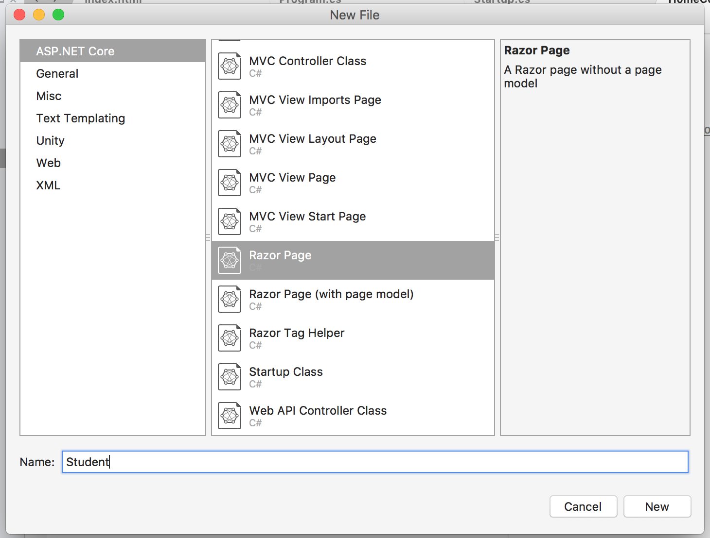

# MVC 구현

- Model : 데이터
- Controller: 로직
- View: User에게 실질적으로 보여주는 부분

## 컨트롤러, 뷰

- Projects > Add > New Folder - Controllers

- Controllers > Add > New Item... > MVC Controller Class

- 마찬가지로 Views 폴더 생성 후 내부에 컨트롤러와 같은 이름으로 폴더 생성, 거기서 Razor 파일 만들기. 이름은 Controller 안에 `IActionResult` 함수의 이름과 같도록 한다.

- 컨트롤러에서 뷰로 도달하려면, Views 폴더 안에 해당 컨트롤 이름과 매칭되는 폴더를 만들고, 그 안에 `IActionResult` 함수 이름과 매칭되는 Razor 파일을 생성해야 한다. 
