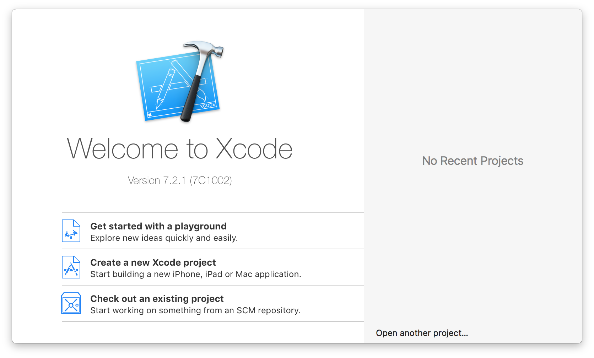
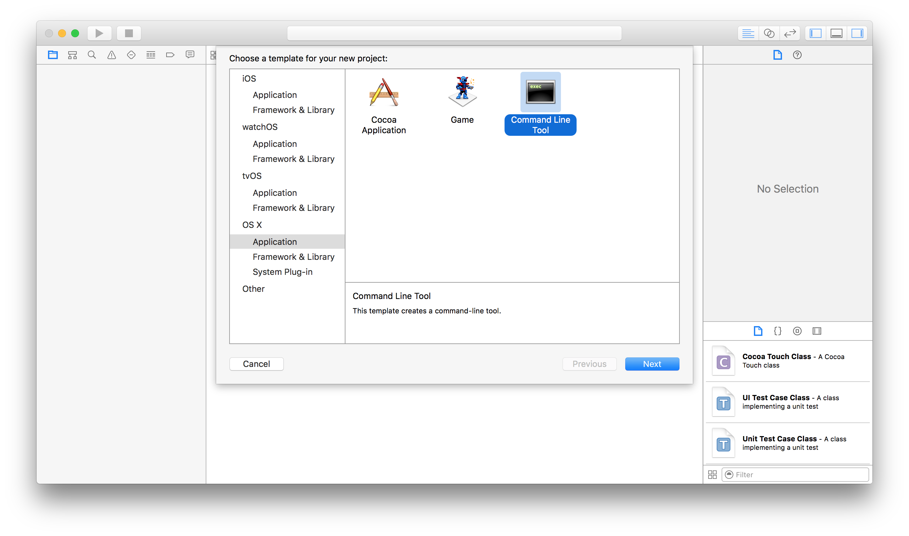
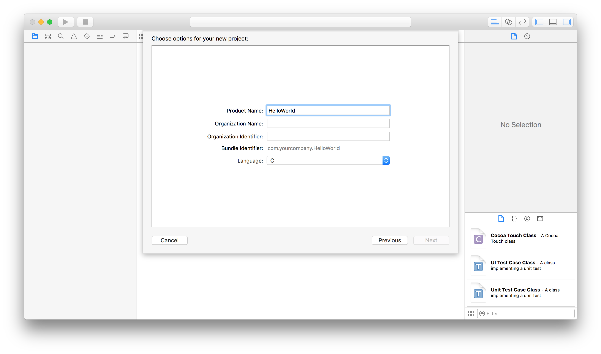
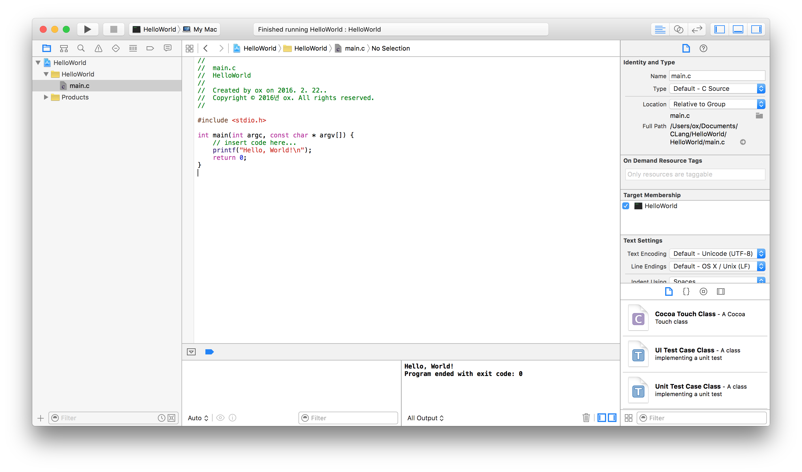

# Xcode에서 C언어 작성  

Xcode설치 후

  

Create a new Xcode project  

  
OS X - Application - Command Line Tool  

  
Product Name, Organization Name, Organization Identifier입력 - Language: C  - 디렉토리 설정  

  

▶︎버튼 클릭 또는 <kbd>⌘</kbd>+<kbd>R</kbd>  
