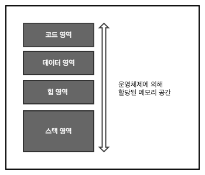
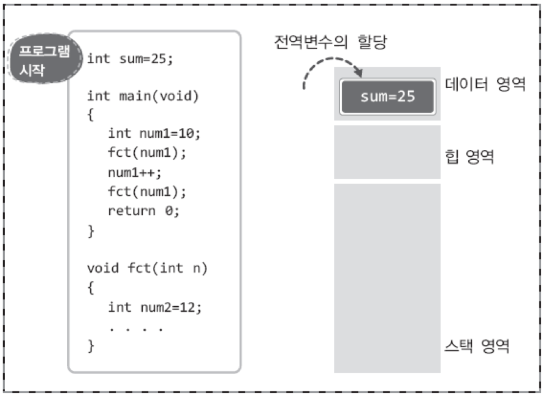
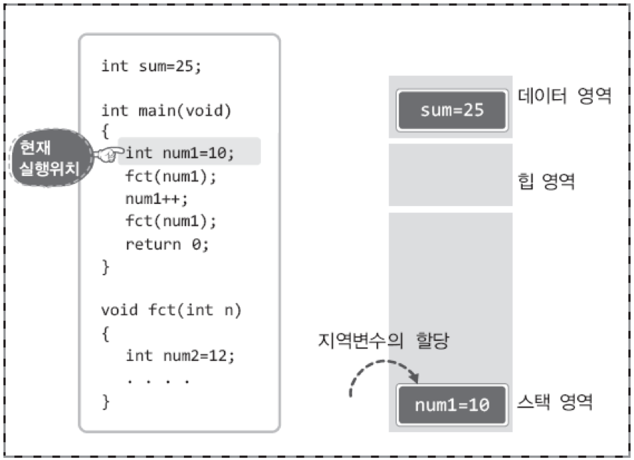
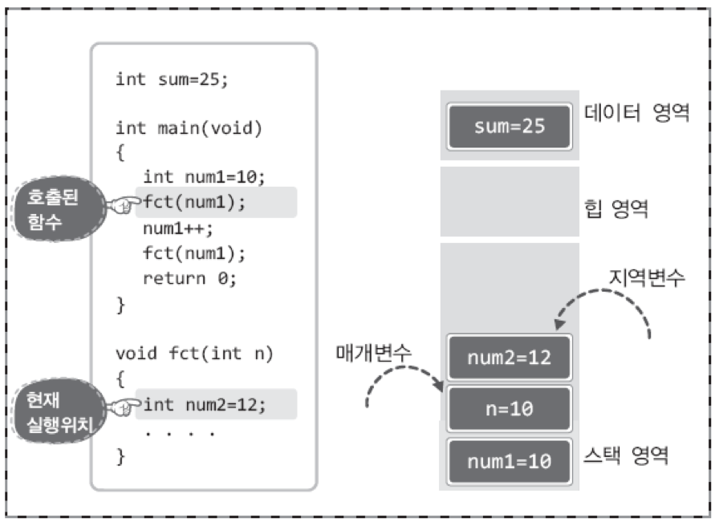
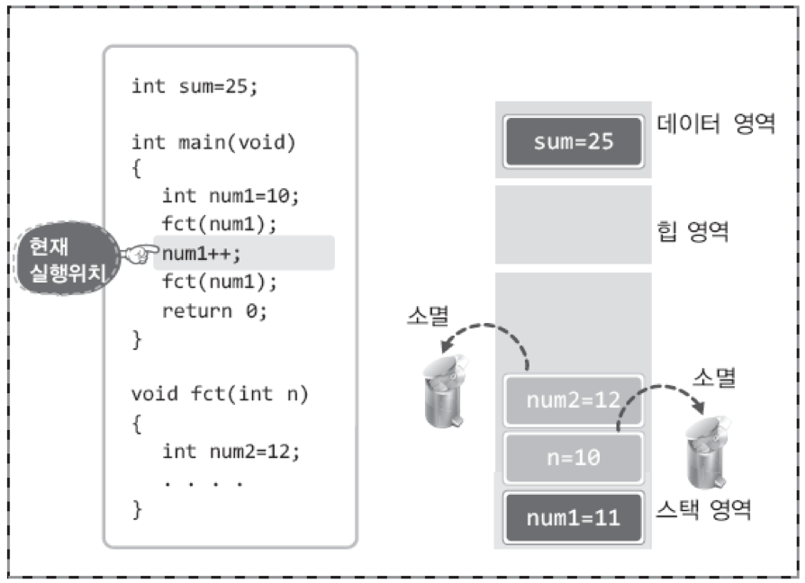
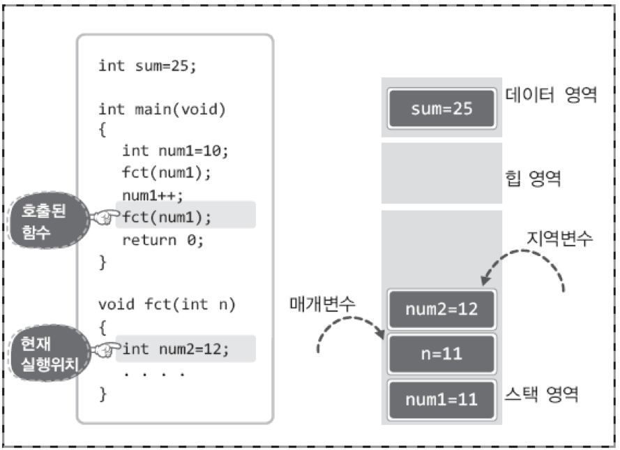
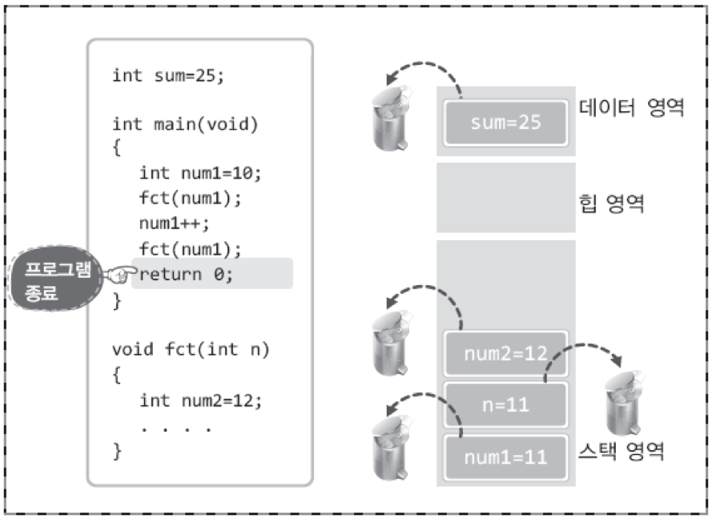

# C언어의 메모리 구조  

- 프로그램을 실행하면 해당 프로그램의 실행을 위한 메모리 공간이 운영체제에 의해 미리 마련된다.  
- 이 메모리 공간 내에서 변수가 선언되고, 문자열이 선언된다.  

## 메모리의 구성  
- 메모리 구조는 다음과 같이 네 개의 영역으로 구분  
   

- aㅔ모리 공간을 나눠놓은 이유  
 - 서랍장의 수납공간이 나뉘는 이유와 유사  
 - 유사한 데이터를 묶어서 저장 → 관리가 용이, 접근속도 향상  

## 메모리 영역별로 저장되는 데이터 유형  
- 코드 영역(Codea Area)  
 - 실행할 프로그램의 코드가 저장되는 메모리 공간  
 - CPU는 코드 영역에 저장된 명령문들을 하나씩 가져가서 실행  

- 데이터 영역(Data Area)  
 - 전역변수, static 변수가 할당  
 - 프로그램의 시작과 동시에 메모리 공간에 할당되어 종료 시까지 남아있게 된다는 특징  

- 스택 영역(Stack Area)  
 - 지역변수, 매개변수 할당  
 - 함수를 빠져나가면 소멸  

- 힙 영역(Heap Area)  
 - 프로그램 구현 시, 데이터 영역이나 스택 영역에 할당되는 변수들과 달리 원하는 시점에 할당하고 소멸하도록 하는 유형의 변수들이 할당되는 영역   

## 프로그램의 실행에 따른 메모리 상태 변화  

- 프로그램의 시작: 전역변수의 할당 및 초기화  
   

- main 함수 호출 및 실행: 지역변수 num1 할당  
   

- main 함수 내의 fct 함수 호출 및 실행: fat의 매개변수, 지역변수 할당  
   

- fct 함수의 반환, 이어서 main 함수 실행: fct의 매개변수와 지역변수 소멸, num1의 값 증가  
   

- fct 함수 재호출 및 실행: 매개변수와 지역변수가 다시 스택에 할당  
   

- fct 함수 반환, main 함수의 return문 실행 프로그램 종료: 운영체제에 의해 할당된 메모리 공간 전체 반환(전역변수 소멸)  
   

함수의 호출 순서가 다음과 같으면...(fct1 내의 fct2함수, fct1함수 반환 후 fct2 함수가 아니라)  
main 함 수의 호출 → fct1 함수의 호출 → fct2 함수의 호출  
지역(매개)변수의 소멸순서는 다음과 같다.  
fct2의 지역변수 소멸 → fct1의 지역변수 소멸 → main의 지역변수 소멸  

- 스택(Stack) - 쌓아 올려진 더미  
- 먼저 호출된 함수의 스택공간일수록 늦게 해제된다!!   
