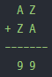

## continue & break  
- 반복문의 생략과 탈출  

### break  
- break문을 가장 가까이서 감싸고 있는 반복문 하나를 빠져 나오게 된다.  

### continue  
- 실행중인 위치에 상관없이 반복문의 조건검사 위치로 이동을 한다.  

## 문제  
- 구구단 출력(짝수 단), 2단은 2x2까지, 4단은 4x4, 6단은 6x6, 8단은 8x8까지만 출력  

```c
#include <stdio.h>

int main(void)
{

	int a, b;

	for (a = 2; a < 10; a+=2)
	{
		for (b = 1; b < 10; b++)
		{
			printf("%dx%d=%d\n", a, b, a*b);
			if (a == b)
				break;
		}
		printf("\n");
	}
	return 0;
}  
```  

- 다음 식을 만족하는 모든 A와 Z를 구하는 프로그램(반복문 중첩)   
     

```c
#include <stdio.h>

int main(void)
{
	int a, z;

	for (a = 0; a < 10; a++)
	{
		for (z = 0; z < 10; z++)
		{
			if (a == z)
				continue;
			if ((10 * a + z) + (10 * z + a) == 99)
				printf("A = %d, Z = %d\n", a, z);
		}
	}
	return 0;
}
```  
