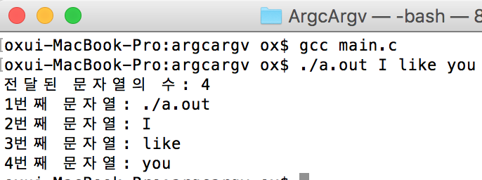

# 함수 포인터와 void 포인터  

변수뿐만 아니라 함수도 바이너리 형태로 메모리 공간에 저장되어 호출 시 실행이 된다. 메모리상에 저장된 함수의 주소 값을 저장하는 포인터 변수가 바로 '함수 포인터 변수'이다.  

## 함수 포인터와 void 포인터  

### 함수 포인터  

**배열의 이름이 배열의 시작주소 값을 의미하듯, 함수의 이름도 함수가 저장된 메모리 공간의 주소 값을 의미한다.**  
배열의 이름과 마찬가지로 함수의 이름도 그 형태가 상수이고, 함수의 주소 값 저장을 위한 포인터 변수를 별도로 선언하는 것도 가능하다. 이러한 용도로 선언된 포인터 변수를 가리켜 '함수 포인터 변수'라 한다.  

```c
int SoSimple(int num1, int num2); { .... }
```
위 함수는 반환형이 int형이고 매개변수로 int형 변수가 두 개 선언되어 있으니 이 함수의 주소값 저장을 위한 함수 포인터 변수는 다음과 같이 선언하면 된다.  
```c
int (*fptr) (int, int);
```
그리고 다음과 같이 대입 연산을 진행하면 된다.  
```c
fptr = SoSimple;
```
대입연산이 끝나고 나면 fptr과 SoSimple에는 동일한 값이 저장되어 상수인지 변수인지가 둘의 유일한 차이점이 된다. 
```c
fptr(3, 4);   // == SoSimple(3, 4);
```

```c
#include <stdio.h>

int WhoIsFirst(int age1, int age2, int (*cmp)(int n1, int n2))
{
    return cmp(age1, age2);
}

int OlderFirst(int age1, int age2)
{
    if(age1>age2)
        return age1;
    else if(age1<age2)
        return age2;
    else
        return 0;
}

int YoungerFirst(int age1, int age2) {
    if (age1 < age2)
        return age1;
    else if (age1 > age2)
        return age2;
    else
        return 0;
}
int main(void)
{
    int age1 = 20;
    int age2 = 30;
    int first;

    printf("입장순서 1 \n");
    first = WhoIsFirst(age1, age2, OlderFirst);
    printf("%d세와 %d세 중 %d세가 먼저 입장! \n\n", age1, age2, first);

    printf("입장순서 2 \n");
    first = WhoIsFirst(age1, age2, YoungerFirst);
    printf("%d세와 %d세 중 %d세가 먼저 입장 \n\n", age1, age2, first);
    return 0;
}
```
```
입장순서 1 
20세와 30세 중 30세가 먼저 입장! 

입장순서 2 
20세와 30세 중 20세가 먼저 입장! 
```
매개변수 선언으로도 함수 포인터 변수가 올 수 있다. 세 번째 인자로 반환형이 int이고 두 개의 int형 변수가 매개변수로 선언된 함수의 이름이 전달되어야 한다.  

### '형(Type)'이 존재하지 않는 void 포인터  

다음과 같이 선언되는 포인터 변수를 가리켜 'void형 포인터 변수'라 한다.  
```c
void * ptr;
```
void형 포인터 변수는 무엇이든 담을 수 있는 바구니에 비유할 수 있다. 어떠한 변수의 주소 값이든 담을 수 있다. 함수의 주소 값도 담을 수 있다.  

```c
#include <stdio.h>

void SoSimpleFunc(void)
{
    printf("I'm so simple");
}

int main(void)
{
    int num = 20;
    void * ptr;

    ptr = &num;     // 변수 num의 주소 값 저장
    printf("%p \n", ptr);

    ptr = SoSimpleFunc;     // 함수 SoSimpleFunc의 주소 값 저장
    printf("%p \n", ptr);
    return 0;
}
```

단점은 아무런 포인터 연산도 하지 못한다. 값의 변경이나 참조도 불가능하다. void형 포인터 변수에는 가리키는 대상에 대한 어떠한 형(type) 정보도 담겨있지 않기 때문이다. void형 포인터는 주소 값에만 의미를 두고 포인터형은 나중에 결정할 때 유용하다.  

## main 함수로의 인자전달  

지금까지의 main 함수의 정의 형태는 다음과 같았다.  
```c
int main(void) { .... }
```
그러나 다음과 같이 정의할 수도 있다.  
```c
int main(int argc, char * argv[]) { .... }
```
프로그램 실행 시 main 함수로 전달할 인자를 열거할 수 있으며(결정할 수 있으며), main 함수 역시 이러한 인자를 전달받을 수 있도록 제한된 형태의 매개변수 선언이 가능하다.  

```c
#include <stdio.h>

int main(int argc, char *argv[])
{
    int i = 0;
    printf("전달된 문자열의 수: %d \n", argc);

    for(i=0; i<argc; i++)
        printf("%d번째 문자열: %s \n", i+1, argv[i]);
    return 0;
}
```
별도의 실행방법으로 실행해야 한다.  
먼저 터미널을 켜 소스코드가 있는 디렉토리로 이동 후 다음과 같이 gcc로 컴파일하고 만들어진 실행파일(a.out)을 실행한다.  
```bash
gcc main.c 
./a.out I love you
```
  

### char * argv[]  

```c
void SimpleFunc(TYPE * arr) { .... }
void SimpleFunc(TYPE arr[]) { .... }
```
TYPE형 1차원 배열의 이름(주소 값)을 인자로 전달받을 수 있는 매개변수 선언이다.  
그래서 main함수의 매개변수 argv는 char형 더블 포인터 변수이고, 이는 char 형 포인터 변수로 이뤄진 1차원 배열의 이름을 전달받을 수 있는 매개변수이다.  


### 인자의 형성과정  

ArgcArgv가 실행되면(a.out), main 함수로 총 4개의 문자열 정보가 전달된다. 공백이 문자열을 나누는 기준이 되는 것이다. 큰따옴표로 묶으면 공백을 포함하는 문자열을 생성해 해 main 함수의 인자로 전달이 가능하다.  

```bash
./a.out "I love you"
```
```
전달된 문자열의 수: 2 
1번째 문자열: ./a.out 
2번째 문자열: I like you 
```


