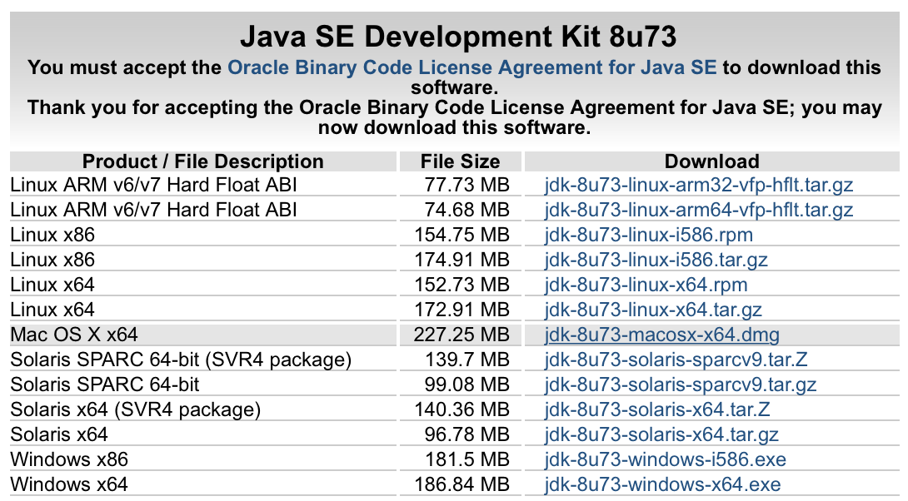
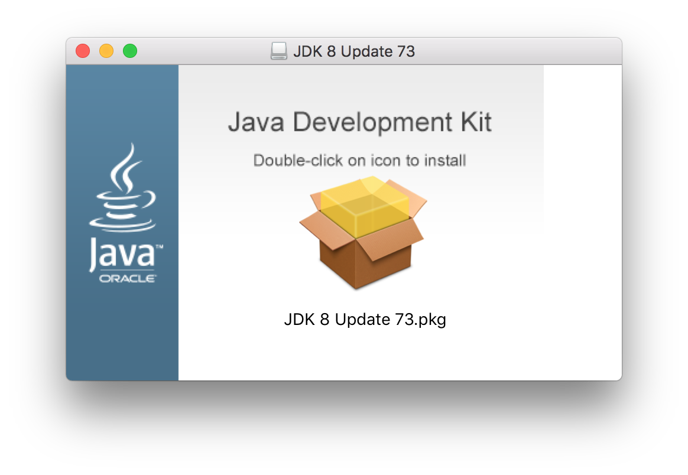

# Mac OS X에서 Java 설치
OS X El Capitan   
Mac에서 원래는 java를 Apple에서 제공했다고 한다. 하지만 보안상의 이유로 더 이상은 제공하지 않고 직접 설치해야 한다.  

## Java SE Downloads  

http://www.oracle.com/technetwork/java/javase/downloads/index.html  

  

Accept License Agreement에 체크하고 Mac OS X x64 버전을 다운받는다.  

  
다운로드 된 `dmg`파일을 실행하고 `pkg`를 더블 클릭해 설치한다.   

## java 버전 확인하기  

터미널을 실행하고 다음 명령어 입력  
```
java -version 
```  

다음과 같이 설치된 버전이 확인된다.  
```bash  
java version "1.8.0_73"
Java(TM) SE Runtime Environment (build 1.8.0_73-b02)
Java HotSpot(TM) 64-Bit Server VM (build 25.73-b02, mixed mode)
```  


