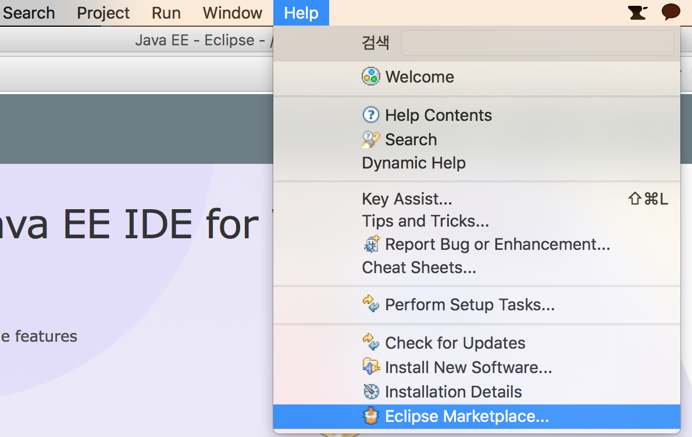
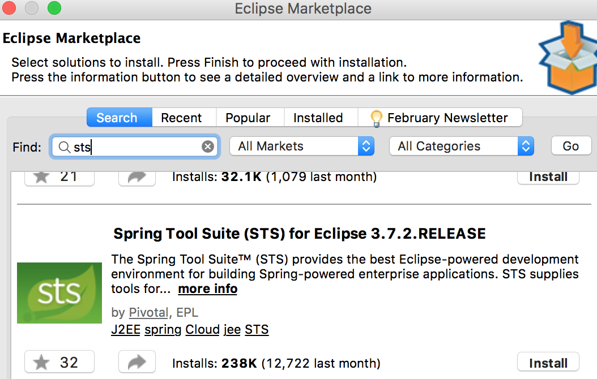
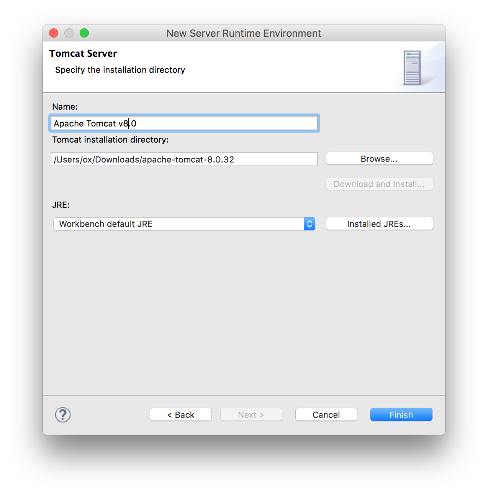
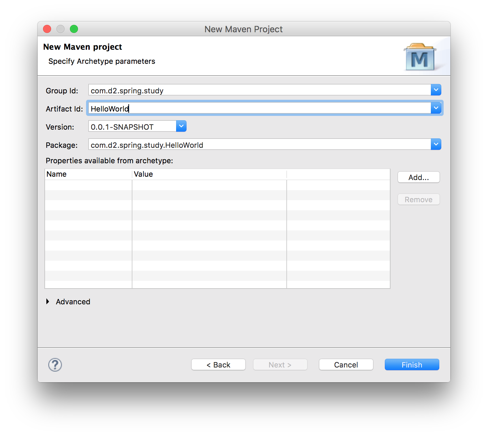
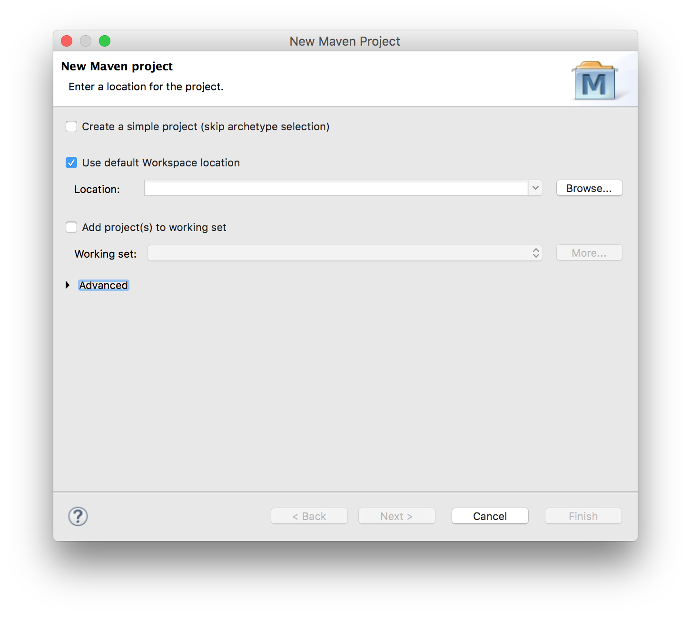
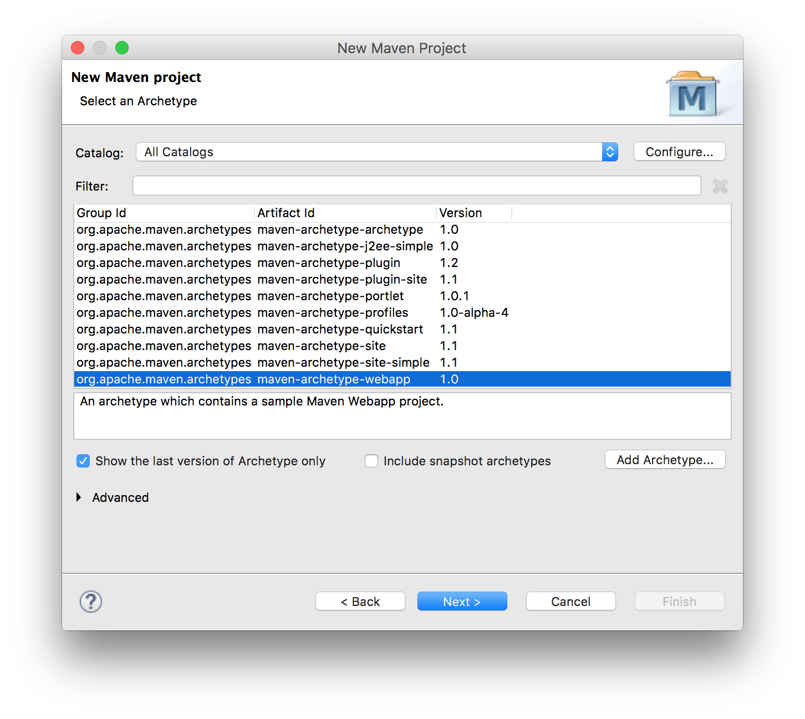
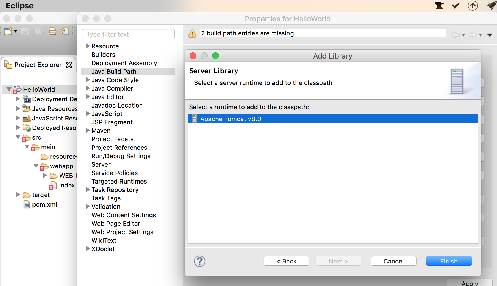

# OS X Spring Framework 개발 환경 구축  

- [JDK 설치](http://www.oracle.com/technetwork/java/javase/downloads/index.html)
 
- STS  
 - https://spring.io/tools
 - 또는 이클립스 + Maven 플러그인 + STS 플러그인  

## 이클립스 설치  
http://www.eclipse.org/downloads/packages/eclipse-ide-java-ee-developers/mars1  

## 이클립스 STS 플러그인 설치  

Eclipse - Help - Eclipse Marketplace  
  

Search탭 - Find: STS 검색 - Spring Tool Suite - Install - 동의하고 Finish - 이클립스 재시작 
  

## Maven 설치  

http://maven.apache.org/download.html  
bin.tar.gz 파일 다운로드  

다운받은 디렉토리로 이동해 다음 명령어로 압축을 푼다.  
```
tar -xvzf apache-maven-3.3.9-bin.tar
```  

압축을 푼 디렉토리에 들어가서 `pwd`명령어로 현재 경로를 확인  
```bash
oxui-MacBook-Pro:Downloads ox$ cd apache-maven-3.3.9
oxui-MacBook-Pro:apache-maven-3.3.9 ox$ pwd
/Users/ox/Downloads/apache-maven-3.3.9
```  

### 환경변수 설정  
환경변수를 설정하면 터미널에서 메이븐을 인식해 실행이 가능하다.(어디서든지)  
홈 디렉토리에서 `.bash_profile`파일에 아래와 같은 내용을 추가한다.   
```
export M3_HOME=/Users/ox/Downloads/apache-maven-3.3.9 // 아까 확인한 경로  
export M3=$M3_HOME/bin
export PATH=$PATH:$M3  
```   

터미널을 재실행하고 `mvn -v`명령어로 확인한다. 제대로 설치됐다면 아래와 같이 나온다.  
```
Maven home: /Users/ox/Downloads/apache-maven-3.3.9
Java version: 1.8.0_73, vendor: Oracle Corporation
Java home: /Library/Java/JavaVirtualMachines/jdk1.8.0_73.jdk/Contents/Home/jre
Default locale: ko_KR, platform encoding: UTF-8
OS name: "mac os x", version: "10.11.3", arch: "x86_64", family: "mac"
```

## 이클립스 Maven 플러그인 설치

STS 플러그인과 마찬가지로 
Eclipse - Help - Eclipse Marketplace    
Search탭 - Find: maven 검색 - Maven Integration for Eclipse - Install  

## apache tomcat 설치  

http://tomcat.apache.org  
`tar.gz`파일 다운로드 후 압축을 풀기  

이클립스 실행 - 환경설정 - 왼쪽 메뉴바에서 Server - Runtime Environments - Add...  

Browse..버튼으로 압축을 푼 경로 지정 - Finish  
  

## Maven 프로젝트 생성  

File New - Maven Project  
  
  
  

### 서블릿 관련 에러 수정(톰캣 설정)  

프로젝트 Properties - Java Build Path - Libraries - Add Library - Server Runtime - Apache Tomcat v8.0 - Finish  

   


## 의존 라이브러리 설정  

`pom.xml` 수정  

```xml 
<dependency>
	<groupId>org.springframework</groupId>
	<artifactId>spring-context</artifactId>
	<version>4.2.4.RELEASE</version>
</dependency>
 
<dependency>
	 <groupId>junit</groupId>
	 <artifactId>junit</artifactId>
	 <version>4.12</version>
	 <scope>test</scope>
</dependency>
 
<dependency>
	 <groupId>org.springframework</groupId>
	 <artifactId>spring-test</artifactId>
	 <version>4.2.4.RELEASE</version>
	 <scope>test</scope>
</dependency>
```
 


 일단 여기까지... 전혀 모르니 알 수가 없다. 나중에 따로 더 공부해야겠다...  
