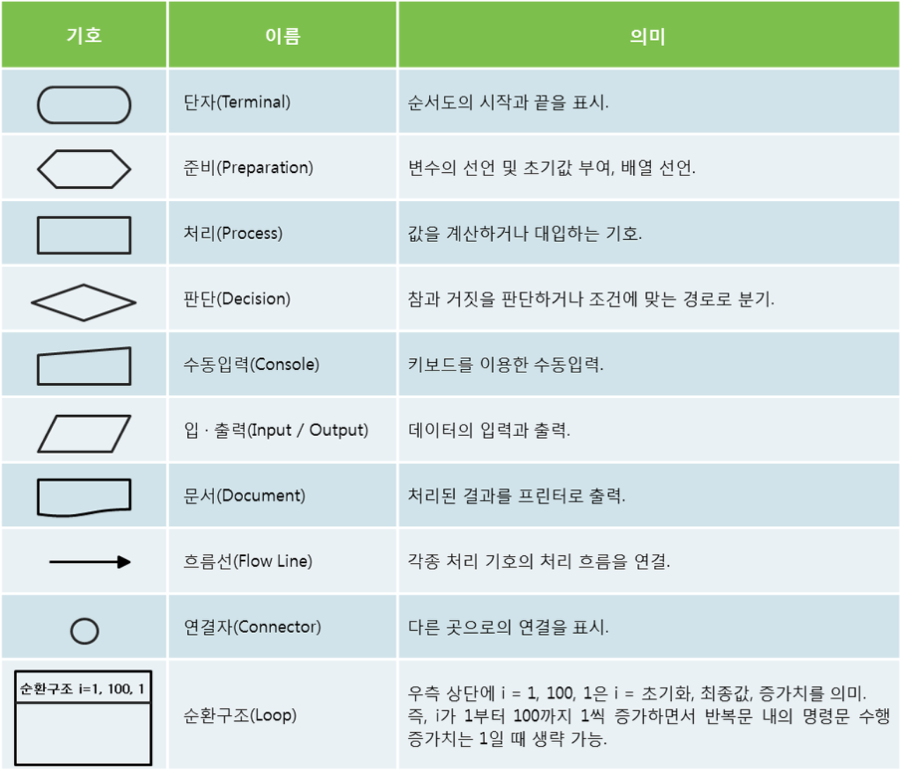
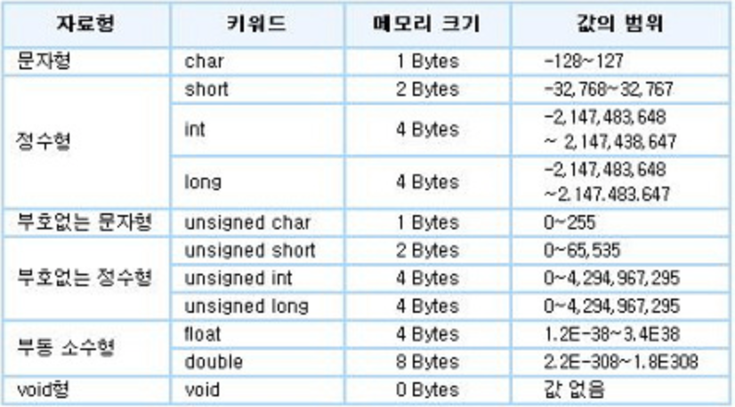
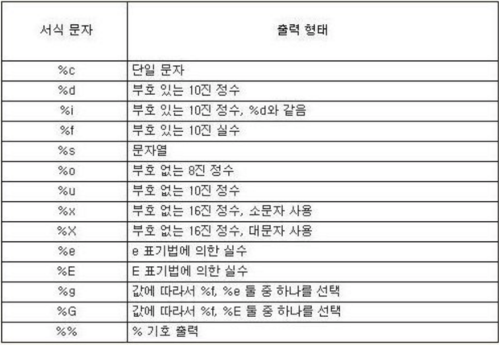

# 프로그래밍 언어의 기본 

## 순서도와 C언어의 기본 

```
#include <stdio.h>

main()
{
    int i, j, k;
    scanf("%d %d", &i, &j);
    k = i + j;
    print("%d\n", k);
}
```

- 순서도     

&nbsp;&nbsp;  
&nbsp;&nbsp;  
&nbsp;&nbsp;  
&nbsp;  
&nbsp;  
&nbsp;  
&nbsp;  
&nbsp;  
&nbsp;  


&nbsp;  
&nbsp;  

## 주요 순서도 기호 



## C언어의 변수 

**변수명 작성 규칙**
- 영문자, 숫자, `_`를 사용하며 글자 수 제한 x
- 중간에 공백 포함 x
- 대・소문자 구분
- 첫 자는 영문자나 `_`로 시작
- 예약어 사용 x
- 변수 선언 시에도 문장 끝에 세미콜론(`;`) 붙이기 


## 자료형 


## 표준 입・출력 함수 

`scanf()`
- 키보드로 입력받아 변수에 저장하는 함수
```c
scanf(서식문자열, 변수의 주소) 
```
- 서식 문자열 


- 기타 
    - `getchar()`: 키보드로 한 문자를 입력받아 변수에 저장 
    - `gets()`: 키보드로 문자열을 입력받아 저장 
    - `putchar()`: 인수로 주어진 한 문자를 화면에 출력 
    - `puts()`: 인수로 주어진 문자열을 화면에 출력 

`print()`
- 인수로 주어진 값 화면에 출력 
```c
print(서식 문자열, 변수)
```
- `scanf`와 달리 &은 안붙인다. 
- 주요 제어문자   

| 제어문자 | 기능                  |
| ---- | ------------------- |
| \n   | 커서를 다음 줄로 옮김        |
| \t   | 탭으로 정해진 만큼 커서 수평 이동 |
| \r   | 커서를 그 줄의 맨 처음으로 이동  |

## 제어문 

```C
#include <stdio.h>
main()
{
    int a = 10, even = 0, odd = 0;
    for (int i = 1; i <= a; ++i) 
    {
        if(i % 2 == 0)
            even += i;
        else
            odd += i;
    }
    printf("%d, %d\n", even, odd);
}
```

- 다중 if 
    ```c
    #include <stdio.h>
    main()
    {
        int jum = 85;
        if (jum >= 90) {
            printf("학점은 A입니다.\n");
        }
        else if (jum >= 80) {
            printf("학점은 B입니다.\n");
        }
        else if (jum >= 70) {
            printf("학점은 C입니다.\n");
        }
        else if (jum >= 60) {
            printf("학점은 D입니다.\n");
        }
        else {
            printf("학점은 F입니다.\n");
        }
    }
    ```
- switch문 
    ```c
    switch(식)
    {
        case 레이블1:
            실행할 문장1;
            break;
        case 레이블2:
            실행할 문장2;
            break;
            .
            .
            .
        default:
            실행할 문장3;
            break;
    }
    ```

- for문
    ```c
    #include <stdio.h>
    main()
    {
        int i, hap = 0;
        for(i = 1; i <= 10; i++i)
        {
            hap += i;
        }
        printf("%d, %d\n", i, hap);
    }
    ```

- while문 
    ```c
    #include <stdio.h>
    main()
    {
        int i = 0, hap = 0;
        while(i < 10)
        {
            i++;
            hap += i;
        }
        printf("%d, %d\n", i, hap);
    }
    ```

- do~while문 
    ```c
    #include <stdio.h>
    main()
    {
        int i = 0, hap = 0;
        do
        {
            i++;
            hap += i;
        } while(i < 10);
        printf("%d, %d\n", i, hap);
    }
    ```

## C언어 포인터, 배열 

### 포인터 
- 주소를 저장할 수 있는 변수
- 포인터 변수 선언 시 자료의 형을 먼저 쓰고 변수명 앞에 `*`를 붙인다.
- 포인터 변수에 주소를 저장하려고 변수의 주소를 구할 때는 변수 앞에 `&`을 붙인다. 
- 실행문에서 포인터 변수에 `*`를 붙이면, 해당 변수가 가리키는 곳의 값을 말한다. 
- 예)
    - a 변수에 100을 저장시키고, a 변수의 주소를 포인터 변수 b에 기억시키기 

&nbsp;  
&nbsp;&nbsp;&nbsp;  
&nbsp;&nbsp;&nbsp;  
&nbsp;  
&nbsp;  
&nbsp;  
- 예제)
    ```c
    #include <stido.h>
    main()
    {
        int a = 20;
        int *b;
        b = &a;
        *b = *b+10;

        printf("%d %p %d\n", a, b, *b);
    }
    ```
    - 30, 주소, 30 

### 배열 

- 1차원 배열 
    - 배열의 이름을 주소로 사용할 수 있다. 
    ```c
    #include <stdio.h>
    main()
    {
        int a[5];

        int i;
        for(i = 0; i < 5; i++)
            a[i] = i + 10;

        for(i = 0; i < 5; i++)
            printf("%d ", a[i]);
    }
    ```
    ```
    10 11 12 13 14
    ```
    &nbsp;  
    ```c
    #include <stdio.h>
    main()
    {
        int a[5];

        int i;
        int *p;
        for(i = 0; i < 5; i++)
            a[i] = i + 10;
        
        p = a;
        for(i = 0; i < 5; i++) 
            printf("%d ", *(p+i));
    }
    ```
    ```
    10 11 12 13 14
    ``` 

- 2차원 배열 
    ```c
    #include <stdio.h>
    main()
    {
        int a[3][4];
        int i, j, k = 0;
        for(i = 0; i < 3; i++)
        {
            for(j = 0; j < 4; j++)
            {
                k++;
                a[i][j] = k;
            }
        }
    }
    ```
    &nbsp;  

    ```c
    #include <stdio.h>
    main()
    {
        char *str;
        str = "KOREA";
        printf("8.3s\n", str);
    }
    // KOR
    ```
    ```c
    #include <stdio.h>
    main()
    {
        char a[] = { 'A', 'B', 'C', 'D', 'E', 'F' };
        char *p;
        p = &a[2];
        printf("%c, %c\n", *p, *(p-2));
        // C, A
    }
    ```
    ```c
    #include <stdio.h>
    main()
    {
        int numAry[] = {1, 0, 0, 0, 0 };
        int i, j;
        for(j = 0; j < 5; ++j)
            for(i = 0; i < j; ++i)
                numAry[j] += numAry[i];
        
        for(j = 0; j < 5; ++j) 
            printf("%d\n", numAry[j]);

        // 1 1 2 4 8
    }
    ```
    ```c
    #include <stdio.h>
    #include <string.h>
    main()
    {
        int k, n;
        char st[] = "I am Tom!";
        char temp;
        n = strlen(st);
        n--;
        for(k = 0; k < n; k++) 
        {
            temp = *(st + k);
            *(st + k) = *(st + n);
            *(st + n) = temp;
            n--;
        }
        printf("%s\n", st);
        // !moT ma I 
    }
    ```

## C언어 함수 

### 사용자 정의 함수 

```c
#include <stdio.h>
void func(int *i, int *j);

main()
{
    int a = 3, b = 12;
    func(&a, &b); // 9, 4
    printf("%d, %d\n", a, b); // 9, 4
}

void func(i, j)
int *i, *j;
{
    *i *= 3;
    *j /= 3;
    printf("%d, %d\n", *i, *j);
}
```

### 내장 함수 

```c
#include <stdio.h> // printf()
#include <string.h> // strlen(), strcpy(), strcmp()
#include <math.h> // pow(), sqrt(), abs()
#include <stdlib.h> // atoi(), atof()

main()
{
    printf("%f\n", pow(2, 3)); // 8.000000
     // 소수점 이하 두자리는 %.2f로 

    printf("%f\n", sqrt(25)); // 5.000000
    printf("%d\n", abs(-20));

    char a[] = "ad";
    char b[] = "ac";
    printf("%d\n", strcmp(a, b)); 
    // 같으면 0, a가 크면 1,b가 크면 -1

    strcpy(a, b); // 복사 b를 a에 복사 
    printf("%d\n", strcmp(a, b));

    char c[] = "123";
    char d[] = "456";
    printf("%d\n", atoi(c) + atoi(d)); // 579

    char e[] = "12.3";
    char f[] = "45.6";
    printf("%f\n", atof(e) + atof(f)); // 57.900000
}

## JAVA 

```java
public class Problem
{
    public static void main (String[] args){
        int i, j = 0;
        for(i = 0; i < 8; i++)
        {
            j = j + i;
        }
        System.out.printf("%d, %d", i, j);
    }
}
```

```java
public class Example {
    public static void main(String[] args){
        int a[] = new int[5];
        int i;
        for(i = 0; i < 5; i++) 
            a[i] = i + 10;
        for(i = 0; i < 5; i++)
            System.out.printf("%4d ", a[i]);
    }
}
```
```
10 11 12 13 14
```

- 향상된 for문 
    - `for(int i : a)`
        - a 배열의 각 요소가 일시적으로 i 변수에 저장된다. 
    ```java
    public class Example {
        public static void main(String[] args){
            int[] a = {90, 100, 80, 70, 60, 50, 30};
            int hap = 0;
            float avg;
            for (int i : a)
                hap = hap + i;
            avg = (float)hap / a.length;
            System.out.printf("%4d, %4.2f", hap, avg);
        }
    }
    ```

### 문자열 

```java
public class Example {
    public static void main(String[] args){
        String str = "Information!";
        int n = str.length();
        char[] st = new char [n];
        n--;
        for(int k = n; k >= 0; k--){
            st[n-k] = str.charAt(k);
        }
        for (char k : st){
            System.out.printf("%c", k);
        }
    }
}
```

### 클래스와 함수 

```java
class Employee{
    String name;
    int idNum;
    int salary;
    boolean sex;
}
public class Example {
    public static void main(String[] args){
        Employee myJik = new Employee();
        myJik.name = "홍길동";
        myJik.idNum = 17001;
        myJik.salary = 4500000;
        myJik.sex = false;
        System.out.printf("%s\n", myJik.name);
        System.out.printf("%d\n", myJik.idNum));
        System.out.printf("%d\n", myJik.salary);
        System.out.printf("%b\n", myJik.sex);
    }
}
```

- 두 수 교환하기
```java
public class Example {
    static class AAclass{ // 클래스 안 클래스 정의 시 static 붙이기 
        int i;
        int j;
    }
    public static void main(String[] args){
        AAclass myVal = new AAclass();
        myVal.i = 10;
        myVal.j = 20;
        myVal = change(myVal);
        System.out.printf("i=%d, j=%d\n", myVal.i, myVal.j);
    }
    static AAclass change(AAclass myVal){
        int temp;
        temp = myVal.i;
        myVal.i = myVal.j;
        myVal.j = temp;
        return myVal;
    }
}
```
