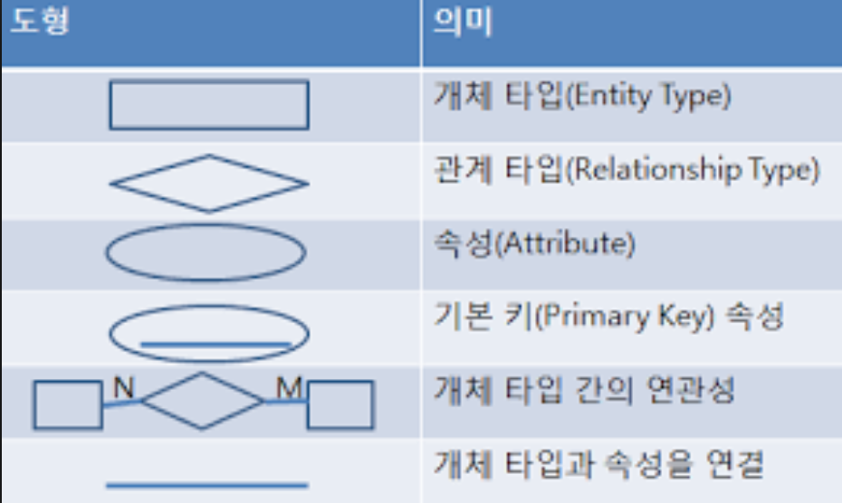

# 데이터베이스 기본 

## 데이터베이스 개념 

### 데이터베이스 정의
- 특정 조직의 업무를 수행하는 데 필요한 상호 관련된 데이터들의 모임 
    - **통합 데이터(Integrated Data)**: 검색 효율성을 위해 중복이 최소화된 데이터의 모임
    - **저장 데이터(Stored Data)**: 컴퓨터가 접근 가능한 저장 매체에 저장된 데이터 
    - **운영 데이터(Operational Data)**: 조직의 목적을 위해 존재 가치가 확실하고 반드시 필요한 데이터 
    - **공유 데이터(Shared Data)**: 여러 응용 프로그램들이 공동으로 사용하는 데이터 

### 데이터베이스 특징 
- **실시간 접근성(Real Time Accessibility)**: 사용자의 질의에 대해 즉시 처리하여 응답
- **계속적인 진화(Continuous Evolution)**: 삽입, 삭제, 갱신을 통해 항상 최근의 정확한 데이터를 동적으로 유지 
- **동시 공유(Concurrent Sharing)**: 여러 사용자가 동시에 원하는 데이터를 공용할 수 있음 
- **내용에 의한 참조(Content Reference)**: DB에 있는 데이터를 참조할 때 튜플(Tuple)의 주소나 위치에 의해서가 아닌 사용자가 요구하는 데이터 내용에 따라 참조 
- **데이터의 논리적, 물리적 독립성(Independence)**
    - 논리적 독립성: 응용 프로그램과 DB를 독립시켜 데이터의 논리적 구조를 변경시키더라도 응용 프로그램은 변경되지 않음 
    - 물리적 독립성: 응용 프로그램과 보조기억장치와 같은 물리적 장치를 독립시켜 DBMS의 성능 향상을 위해 새로운 디스크를 도입해도 응용 프로그램에는 영향 x, 데이터의 물리적 구조만 변경된다. 

### 데이터 언어(Data Language)

- DB를 구축, 이용하기 위한 DBMS와의 통신 수단 
- 종류
    - DDL(데이터 정의어)
        - DB 구조, 데이터 형식, 접근 방식 
        - DB를 구축이나 변경 목적으로 사용 
        - DDL 컴파일러가 컴파일한 후 데이터 사전에 저장 
        - 기능 
            - DB의 논리적, 물리적 구조를 정의 및 변경
            - 스키마(Schema)에 사용되는 제약 조건 정의
            - 데이터의 물리적 순서를 규정 
    - DML(데이터 조작어)
        - 데이터 처리를 위한 App과 DBMS 간의 인터페이스를 위한 언어
        - 데이터 처리를 위한 검색, 삽입, 삭제, 갱신 연산 등 존재 
        - 형태
            - 절차적 DML: 사용자가 어떤 데이터를 필요로 하는지, 필요한 데이터를 어떻게 구하는지 명시. 배우기 어렵, 조작 어렵 
            - 비절차적 DML: 사용자가 어떤 데이터가 필요한지만 명시. 배우기 쉽고 사용 쉬움, 코드 효율성 비효율적 
    - DCL(데이터 제어어) 
        - 보안 및 권한 제어, 무결성, 회복, 병행 제어를 위한 언어 
        - 기능
            - 데이터 보안: 권한이 없는 접근으로부터 DB 보호
            - 데이터 무결성: 의미적 측면에서 데이터가 정확하고 완전함을 의미. 
            - 데이터 회복: 시스템 오류 등으로부터 DB를 회복 
            - 병행 제어: 여러 사용자가 동시에 DB 공유 가능토록 한다. 

### 데이터베이스 사용자 

- **데이터베이스 관리자(DBA: DataBase Administrator)**
    - DDL과 DCL을 통해 DB를 정의하고, 제어하는 사람 또는 그룹 
    - DBMS와 컴퓨터 시스템, 조직 내 전산 업무에 상당한 지식을 보유해야 함 
    - DB를 설계, 관리, 운용 및 통제하며, 효율성, 경제적 효용성을 높이기 위해 시스템 감시, 성능을 분석
- **데이터 관리자(Data Administrator)**
    - 하나의 기업, 조직 내에서 데이터에 대한 정의, 체계화, 감독 및 보안 업무
    - 기업, 조직 전반에 걸쳐 존재하는 데이터 관리 총괄
    - 정보 활용에 대한 중앙 집중적 계획 수립 및 통제 수행 
    - 전사적으로 수립된 데이터 표준 원칙, 데이터 표준, 데이터 표준 준수 여부 관리 등
- **데이터 설계자(Data Architect)**
    - 데이터 구조를 체계적으로 정의
    - 데이터 구조 원칙, 정보, 관리 등을 정의
    - 데이터 표준, 관리 체계 등을 포함하는 데이터 영역을 분류, 이를 기준으로 데이터 모델 생성 
- **응용 프로그래머(Application Programmer)**
    - 프로그래밍 언어에 DML을 삽입해 DB에 접근 
    - 프로그래밍 언어 사용, DBMS에 대해서도 어느정도 아는 전산 전문가 
- **일반 사용자**
    - 질의어(Query Lanaguage)를 통해 DBMS에 접근
    - 컴퓨터/DBMS 지식 없어도 됨.
    - 데이터 삽입, 삭제, 갱신, 검색 의 목적으로 DBMS를 이용 


## 데이터베이스 관리 시스템(DBMS)

### DBMS의 개념 
- 사용자의 요구에 따라 정보를 생성, DB를 관리해주는 SW 
- 기존의 파일 시스템이 갖는 데이터의 종속성, 중복성 문제를 해결하기 위해 제안된 시스템.
- 모든 App 들이 DB를 공유할 수 있도록 관리해줌 
- 기존 파일 시스템의 문제점
    - 데이터 종속성: App과 데이터 파일 간 송호 의존적 관계가 존재. 데이터 파일이 보조기억장치에 저장되는 방법이나 저장된 데이터의 접근 방법을 변경할 때 응용 프로그램도 같이 변경해야 하는 문제점이 있음
    - 데이터 중복성: 중복된 데이터 간에 내용이 일치하지 않아 일관성 x. 동등한 보안 수준 유지가 어렵고, 정확성이나 무결성을 효율적으로 유지 x 

### DBMS의 필수 기능 
- **정의 기능(Definition Facility)**: 데이터의 타입과 구조, 데이터가 DB에 저장될 때 제약 조건 등을 명시
- **조작 기능(Manipulation Facility)**: 체계적 데이터 처리를 위해 데이터 접근 기능(검색, 삽입, 삭제, 갱신 등)을 명시하는 기능 제공
- **제어 기능(Control Facility)**: 데이터의 정확성, 안전성 유지를 위해 무결성, 보안 및 권한 검사, 병행 제어 등을 명시하는 기능 제공 

### DBMS의 장단점 
- 장점
    - 데이터의 논리적, 물리적 독립성 보장
    - 데이터 중복 x
    - 데이터를 공동 이용 가능
    - 데이터 통합 관리
    - 데이터 표준화
    - 일관성 유지
    - 무결성 유지
    - 보안 유지
    - 실시간 처리 가능 
    - 항상 최신 데이터 유지 
- 단점
    - DBA 전문가 부족 
    - 대용량 디스크로의 집중적인 접근(Access)으로 과부하 발생
    - 전산화 비용 증가 
    - 데이터 백업과 회복 어려움 
    - 시스템 복잡 

> 데이터 스트림 관리 시스템 (DSMS)  
무선 센서 네트워크나 인터넷 같은 통신상에서 발생하는 대량의 스트림 데이터를 처리하고 관리하는 시스템  
디스크의 릴레이션에 저장된 정적이고 영구적인 데이터를 처리하고 관리하기 위한 DBMS와는 달리 온라인상 데이터 스트림이라는 동적인 특성을 가진 데이터를 처리하고 관리  
온라인상에서 연속적인 질의를 실행하면서 실시간으로 데이터를 처리하고, 관리하기 때문에 질의의 입력 순서에 따라 데이터 처리 결과가 달라질 수 있음 

## 스키마 

### 스키마의 개념 
- DB의 구조와 제약 조건에 관한 전반적인 명세를 의미
- DB를 구성하는 데이터 개체, 속성, 관계 및 데이터 조작 시 데이터 값들이 갖는 제약 조건 등에 관해 전반적으로 정의
- 사용자 관점에 따라 외부 스키마, 개념 스키마, 내부 스키마로 나뉨 

### 스키마의 특징 
- 데이터의 구조적 특성을 의미
- 데이터 사전에 저장됨
- 현실 세계의 특정한 한 부분의 표현으로, 특정 데이터 모델을 이용해서 만들어짐 
- 시간에 따라 불변인 특성을 가짐 
- 데이터의 논리적 단위에 명칭을 부여, 그 의미를 기술 

> 데이터 사전   
DB에 저장된 모든 데이터 개체들에 대한 정보를 유지, 관리하는 시스템. 시스템 카탈로그라고도 한다.  
데이터 사전에는 데이터에 관한 데이터가 저장되어 있다고 하여 데이터 사전을 메타 데이터라고도 한다.  

> 메타 데이터  
데이터에 관한 데이터.  실제 저장되는 데이터는 아니지만, 저장되는 데이터와 직접, 혹은 간접적으로 관계가 있는 정보를 제공하는 데이터  
메타 데이터 포맷  
MARC(Machine Readable Cataloging): 목록 레코드를 식별해 축적, 유통할 수 있도록 코드화한 메타데이터  
DC(Dublin Core): 네트워크 환경에서 각종 전자 정보를 기술하는 메타 데이터  
ONIX(ONline Information eXchange): 유통에 관한 통계와 체계적인 정보를 취급함으로써 정상적인 유통및 관리를 위한 메타 데이터  
MODS(Metadata Object Description Schema): 디지털 도서관의 범용 서지 정보 표준 메타 데이터. MARC, DC, ONIX 등을 절충해 상호운용성과 정밀성 모두 만족시킴   
상호운용성 확보를 위한 방법: 자원을 하나의 표준적인 메타 데이터로 통합해 표현한다. 자원의 특성을 감안해 다양한 데이터 형식과 기술 구조를 인정하고 상호 매핑을 통해 해결하는 방법, MDR에 의한 해결방법이 있음. 

> MDR  
메타 데이터의 등록과 인증을 통해 메타 데이터를 유지, 관리하며 메타 데이터의 명세를 공유하는 레지스트리 


### 스키마의 3계층 
- 외부 스키마 
    - 사용자나 응용 프로그래머가 각 개인의 입장에서 필요로 하는 DB의 논리적 구조를 정의한 것 
    - 전체 DB의 한 논리적인 부분으로 볼 수 있으므로 서브 스키마라고도 한다.  
    - 하나의 DBMS에는 여러 개의 외부 스키마가 존재할 수 있고, 하나의 외부 스키마는 여러 개의 응용 프로그램이나 사용자에 의해 공유될 수 있다.  
    - 외부 스키마는 동일한 DB에 대해 서로 다른 관점을 정의할 수 있도록 허용 
- 개념 스키마 
    - 개체 간의 관계와 제약 조건을 나타내고 DB의 접근 권한, 보안 정책 및 무결성 규정에 관한 명세를 정의
    - DB의 전체적인 논리적 구조로 모든 응용 프로그램이나 사용자들이 필요로 하는 데이터를 통합한 조직 전체의 데이터베이스 명세로서 하나만 존재  
    - 단순히 스키마라고 하면 개념 스키마를 의미 
    - 기관이나 조직의 관점에서 DB를 정의한 것
    - DBA에 의해 작성됨 
- 내부 스키마
    - DB의 물리적 구조를 정의한 것
    - 물리적 저장장치의 관점에서 본 전체 DB의 명세로서 하나만 존재
    - 개념 스키마의 물리적 저장 구조에 대한 정의를 기술
    - 시스템 프로그래머나 시스템 설계자가 보는 관점의 스키마 

## DB 설계

### DB 설계 개념 
- DB의 구조, 데이터베이스 스키마를 개발하는 과정 
- 단계
    - 요구 조건 분석(Requirement Analysis)
    - 개념적 설계(Conceptual Design)
    - 논리적 설계(Logical Design)
    - 물리적 설계(Physical Design)
    - 데이터베이스 구현(Database Implementation)
- 데이터 중심 설계: 데이터베이스의 구조에 치중
- 처리 중심 설계: 데이터 처리 및 응용에 치중 

### 요구 조건 분석 
- DB를 사용할 사람이 필요로 하는 용도를 파악하는 작업
- 사용자 요구 조건을 수집, 분석 -> 공식적인 요구 조건 명세 작성
- 수집, 분석해야 하는 요구 조건
    - 개체, 속성, 관계, 제약 조건 등, 정적 정보 구조
    - 트랜잭션의 유형, 실행 빈도 = 동적 DB 처리 요구 조건
    - 기관의 경영 목표 및 정책, 규정 같은 범기관적 제약 조건에 대한 요구 조건 
- 작성된 요구 조건 명세는 주요 사용자 그룹과 함께 다시 검토 -> 확인 후 최종 시스템 명세로 확정 

> 트랜잭션  
DB에서 하나의 논리적 기능을 수행하기 위한 일련의 연산 집합. 작업의 단위가 된다.  

### 개념적 설계
- 정보의 구조를 얻기 위해 현실 세계의 무한성, 계속성을 이해 
- 다른 사람과 통신을 위해 현실 세계에 대한 인식 -> 추상적 개념으로 표현하는 과정  
- 개념 스키마 모델링(ER 도형)
    - 데이터의 조직과 표현에 치중 
    - -> 데이터 중심 설계
    - 개념적 데이터 모델에서의 데이터 구조, 즉 개념 스키마를 기술하는 과정 
    - 기본적 원리는 추상화
        - 추상화: 복잡한 것들을 단순화. 여러 속성들을 그룹지어 하나의 개체로 만드는 **집단화**/공통 성질을 가진 여러 부류의 개체들을 보다 일반적이고 포괄적인 개체로 만드는 **일반화**

> 집단화/일반화  
집단화: 학번, 이름, 학과 등 속성들을 그룹지어 학생이라는 개체를 만드는 과정  
일반화: 대학원생과 학부생의 개체들을 좀 더 일반적인 학생이라는 개체로 만드는 과정  


- 트랜잭션 모델링을 병행해서 수행 
    - 응용을 위한 데이터 처리에 치중
    -  -> 처리 중심 설계 
    -  트랜잭션의 입, 출력과 기능적 혀태를 정의하는 트랜잭션 명세를 작성  
    -  입력 데이터, 출력 데이터, 제어의 기능적 흐름을 명세  
        -  트랜잭션을 개념적이고 시스템 독립적으로 정의할 수 있음  

### 논리적 설계  
- 현실 세계에서 발생하는 데이터 형태를 컴퓨터가 이해하고 처리할 수 있는 **특정 DBMS이 지원하는 논리적 데이터 구조로 변환**시키는 과정 
- 논리 스키마를 설계
- 순서
    - 특정 DBMS을 선정 
        - 선정에는 소프트웨어 획득 비용, 유지 비용, DB 구축 및 전환 비용, 교육 및 운용 비용 등을 고려 
    - 관계형 DBMS를 선정한 경우 
        - 개념적 설계에서 기술한 ER 도형을 정형적 규칙에 따라 릴레이션 스키마로 변환 
            - 더 좋은 릴레이션 스키마를 만들기 위해서는 **정규화** 과정을 수행 
- 개념적 설계에서 기술한 트랜잭션 명세로부터 트랜잭션의 전체적 골격을 개발, 인터페이스를 정의  

> 정규화   
다양한 유형의 검사를 통해 데이터 모델을 좀더 구조화, 개선시켜나가는 과정  

### 물리적 설계
- 주어진 App에 대한 성능 향상을 위해 DB 파일에 대한 특정한 저장 구조와 접근 경로를 결정하는 과정 
- 효율적이고 구현 가능한 물리적 DB구조, 즉 물리 스키마를 설계하는 것이 목적  
- 저장 구조를 위한 레코드의 양식, 순서, 저장 공간 등 
- 접근 경로를 위한 인덱싱, 해싱 등의 설계가 포함 
- 특정 DBMS 뿐 아니라 특정 하드웨어 및 OS의 특성도 고려해야함 
- 효과적인 설계를 위해 DB 트랜잭션을 요청해 응답을 얻기 까지의 응답 시간, DB 파일과 접근 경로 구조에 대한 저장 공간의 효율성, 일정 단위 시간 동안 처리되는 트랜잭션의 평균 수인 트랜잭션 처리도 등을 고려해야 함 
- 논리적 설계에서 기술한 트랜잭션의 인터페이스로부터 상세 트랜잭션을 정의 


### 데이터베이스 구현 
- 데이터베이스를 실제로 구축하는 과정 
- 선정된 DBMS의 DDL로 기술된 명령문을 실행시켜 DB 스키마와 DB 파일을 생성 
- 필요한 경우 DB에 데이터를 입력 
- 응용 프로그래머에 의해 상세 트랜잭션이 샐행 트랜잭션으로 구현됨 
    - DML로 기술된 명령문을 가지는 프로그램 코드가 작성  


## ER(Entity Relationship) 모델 
개체, 속성, 관계 등에 대해 용이하게 표현할 수 있는 ER 도형을 정의하고 있음 

### ER 도형 
- 몇 가지 도형들을 이용해 현실세계를 표현   


- 기본키: 개체 타입에서 개체를 유일하게 식별해 주는 속성 또는 속성 집합
- ISA 관계: 특정 개체는 서로 구별되는 여러 하위 개체로 나누어질 수 있음. ISA는 이러한 상위 개체와 하위 개체 간의 관계를 의미 
    - 예) 학생 개체는 재학생, 휴학생, 졸업생 개체로 구별된다. 

### 개체 및 개체 타입 
- 개체: 현실 세계의 객체로서 유형 또는 무형의 정보 대상으로 존재하며 서로 구별될 수 있는 것. 개체의 특성을 나타내는 **속성**을 가짐 
- 하나의 개체: 어커런스 또는 개체 인스턴스 
- 개체 어커런스들의 집합에 대한 공통의 특성을 갖는 개체 클래스를 **개체 타입**이라 한다.  
    - 예) 학과명을 갖는 교수는 개체 타입. 이름은 홍길동, 학과는 컴공인 교수 데이터는 개체 어커런스. 교수라는 타입에 대해 홍길동, 이순신 등의 개체 어커런스가 존재할 수 있음 

### 관계 및 관계 타입 
- 관계: 2개 이상의 개체 사이에 존재하는 연관성을 뜻함 
- 관계 타입: 같은 관계들의 집합 또는 틀을 뜻함 
- 관계는 관계에 참여하는 개체 타입의 개수에 대한 **차수**(Degree)와 관계에 참여하는 개체 어커런스의 개수에 대한 **대응 카디널리티**(Mapping Cardinality)를 갖는다.  
- 차수에 따른 관계의 종류
    - 단항 관계: 관계에 참여하고 있는 개체 타입이 1개
    - 이항 관계: '' 2개
    - 삼항 관계: '' 3개
    - n항 관계: '' n개  
- 대응 카디널리티에 따른 관계의 종류  
    - 1:1 관계: 관계에 참여하고 있는 두 개체 타입이 모두 하나씩의 개체 어커런스를 갖는 관계
    - 1:N 관계: 관계에 참여하고 있는 개체 타입 중 한 개체 타입은 여러 개의 개체 어커런스를 가질 수 있고, 다른 한 개체 타입은 하나의 개체 어커런스를 갖는 관계 
    - N:M 관계: 관계에 참여하고 있는 두 개체 타입 모두 여러 개의 개체 어커런스를 가질 수 있는 관계 
    - ISA 관계
        - 같은 속성을 갖는 여러 개체들을 하나의 상위 개체로 결합할 수 있고
        - 특정 개체는 서로 구별되는 하위 개체로 나누어질 수 있다. 
        - 상위 개체의 멤버는 하나의 하위 개체에만 포함 될 수 있고(disjoint), 여러 하위 개체에 포함(overlapping)될 수 있다. 
        - 상위 개체의 멤버는 하위 개체에 속할 수도 있고(total), 속하지 않을 수도 있다(partial).  

### 속성

- 개체의 특성이나 상태를 기술한 것 
- 관계 역시 개체와 마찬가지로 속성을 가질 수 있음 
- 속성이 가질 수 있는 모든 가능한 값들의 집합을 도메인(Domain)이라 한다. 
- 모든 개체 타입은 그 개체를 유일하게 식별해 주는 기본키에 속하는 속성을 포함 
- 속성에는 더 이상 다른 속성으로 나눌 수 없는 단순 속성과 2개 이상의 속성들로 분해할 수 있는 복합 속성이 있다.  


### 요구 사항을 이용해 ERD 만들기  

<요구 사항>
```
- 은행은 예금 서비스를 고객에게 제공
- 은행은 여러 지점으로 구성, 각 지점은 특정 도시에 위치 
- 각 지점은 고유의 지점명 부여, 추가로 도시, 자산, 영문지점명, 지점개설일, 전화번호 등의 정보를 가짐 
- 고객은 고유의 고객번호를 가지며, 추가로 이름, 주소, 생년월일 등의 정보를 가짐 
- 예금계좌는 예금번호로 유일하게 식별되고, 예금계좌의 잔고와 입,출금 내역이 관리됨 
- 한 명의 고객은 여러 개의 예금계좌에 예금할 수 있고, 하나의 예금계좌에는 여러 명의 고객이 예금 가능 
- 지점은 여러 개의 예금계좌를 관리 
```
&nbsp;  
&nbsp;  
&nbsp;  
&nbsp;&nbsp;  
&nbsp;  
&nbsp;&nbsp;  
&nbsp;  


 


