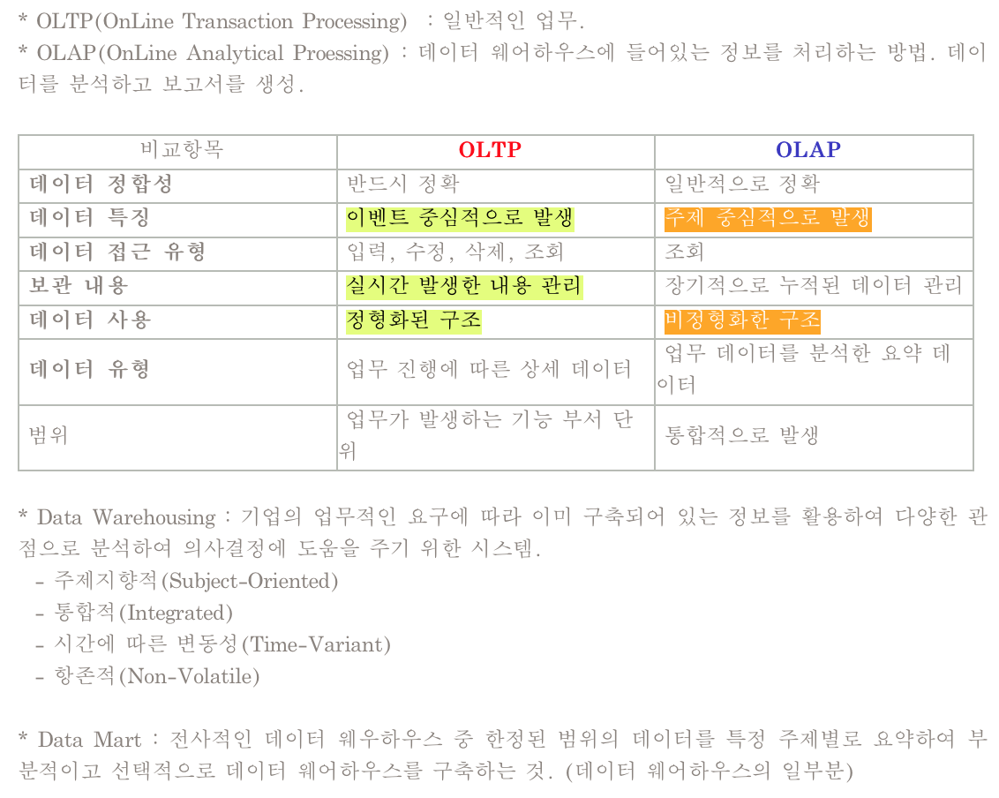
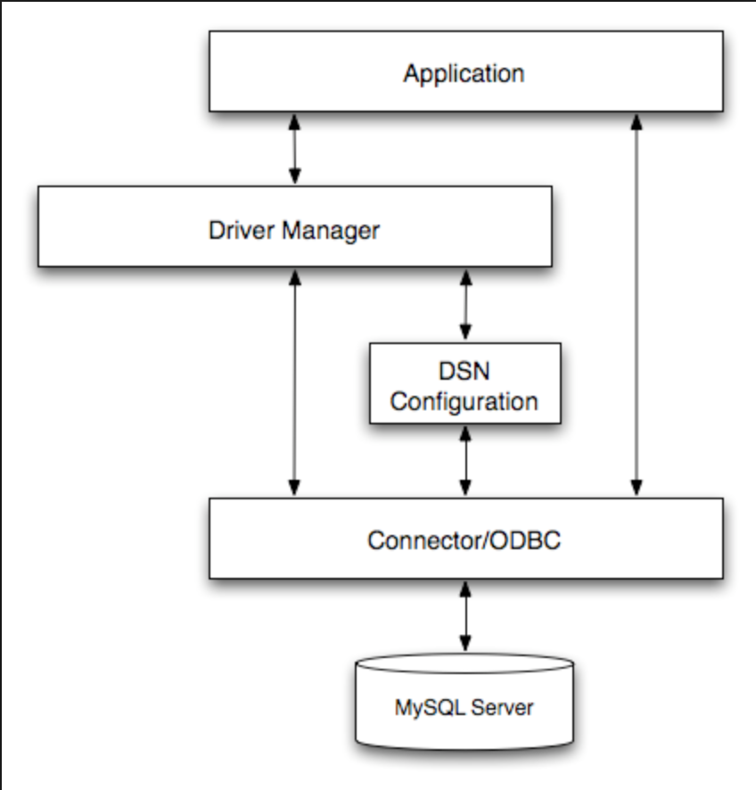

# 데이터베이스 기타 실무 응용 

## 시스템 카탈로그  

### 개념 
- 데이터베이스 관리자(DBA)의 도구 
- 데이터베이스에 저장되어 있는 모든 데이터 개체들에 대한 정의나 명세에 관한 정보가 수록되어 있는 시스템 테이블  
- 데이터사전(Data Dictionary)라고도 함  
- DDL의 결과로 구성되는 기본 릴레이션, 인덱스, 뷰, 사용자, 접근 권한 등 데이터베이스 구조 및 통계 정보가 저장됨  
- 시스템 카탈로그에 저장된 내용을 메타데이터 라고 함  
- 사용자와 데이터베이스 관리 시스템에 접근이 가능  

### 내용 
**릴레이션 관련 정보**
- 릴레이션이름
- 릴레이션이 저장된 파일 이름과 파일 구조  
- 릴레이션의 속성들에 대한 속성 이름과 타입(또는 도메인)  
- 릴레이션에 대해 정의된 각 인덱스의 이름  
- 릴레이션에 대해 정의된 무결성 제약 조건  

> 인덱스  
데이터 레코드(튜플)에 빠르게 접근하기 위해 <키 값, 포인터> 쌍으로 구성되는 데이터 구조  

**인덱스 관련 정보**
- 인덱스명
- 인덱스 구조  
- 인덱스 키에 대한 정보  

**뷰 관련 정보**
- 뷰의 이름 
- 뷰의 정의
- 뷰의 소유자  

**통계 관련 정보**
- **릴레이션 카디널리티**: 각 릴레이션에 저장된 레코드의 수  
- **인덱스 카디널리티**: 각 인덱스에 저장된 레코드의 수 
- **인덱스의 높이**: 각 트리 인덱스에 대한 레벨  
- **인덱스의 범위**: 각 인덱스에 대한 최소 키 값과 최대 키 값   

**사용자 관련 정보**
- 사용자 계정 정보 
- 사용자 권한 정보

### 시스템 카탈로그의 특징  
- 카탈로그 자체도 시스템 테이블로 구성되어 있어 사용자가 SQL문을 이용해 내용 검색이 가능  
- 데이터베이스 관리 시스템에 의해 생성되고 유지됨  
- 갱신  
    - 사용자가 SQL문을 실행시켜 기본 테이블, 뷰, 인덱스 등을 변경하면 데이터베이스 관리 시스템이 자동으로 시스템 카탈로그를 갱신  
    - 사용자가 SQL문으로 시스템 카탈로그를 직접 갱신하는 것은 허용되지 않음  
- 분산 시스템에서의 시스템 카탈로그는 보통의 릴레이션, 인덱스, 사용자 등의 정보를 포함할 뿐 아니라 **위치 투명성** 및 **중복 투명성**을 제공하기 위해 필요한 모든 **제어 정보도 포함**

> 위치 투명성  
접근하려는 데이터베이스의 실제 위치를 알지 못해도 데이터베이스의 논리적인 명칭만으로 데이터베이스에 접근할 수 있는 특성  

> 중복 투명성  
동일 데이터가 여러 곳에 중복되어 있더라도 사용자는 마치 하나의 데이터만 존재하는 것처럼 사용하고, 시스템은 자동으로 여러 데이터에 대한 작업을 수행하는 특성  

#### 구성 요소  

**SYSOBJECTS**
- 사용자가 릴레이션, 뷰, 제약 조건, 규칙, 저장 프로시저 등 데이터베이스에서 만들어진 각 개체에 대한 정보를 한 행으로 관리  
- SYSOBJECTS는 개체명, 소유자, 개체종류, 생성일 등으로 구성  

**SYSCOLUMNS**
- 시스템 내 모든 테이블에 대해 각 테이블이 가지고 있는 모든 열(속성)에 대한 정보를 한 행으로 관리  
- SYSCOLUMNS는 속성명, 테이블명, 소유자, 속성타입, 자릿수 등으로 구성  

**SYSINDEXES**
- 시스템에 있는 모든 인덱스에 대한 정보를 한 행으로 관리  
- 인덱스명, 테이블명, 속성수, 튜플수 등으로 구성

**SYSVIEWS**
- 시스템에 있는 모든 뷰에 대한 정보를 한 행으로 관리 
- 뷰명, 소유자, 뷰명령문 등으로 구성  

**SYSUSERS**
- 해당 DB를 사용할 수 있는 사용자와 그룹에 관한 정보를 한 행으로 관리  
- 사용자ID, 사용자명, 그룹명 생성일 등으로 구성  

**SYSPROTECTS**
- 데이터베이스의 계정에 적용된 사용자 권한에 관한 정보를 한 행으로 관리
- 개체명, 사용자ID, 권한, 보호타입 등으로 구성  

## 인덱스  

### 인덱스의 개념  
- 데이터 레코드(튜플)에 빠르게 접근하기 위해 <키 값, 포인터> 쌍으로 구성되는 데이터 구조  
- 색인이 없으면 특정한 값을 찾기 위해 모든 데이터 페이지를 다 뒤지는 TABLE SCAN이 발생  
- 기본 인덱스: 기본 키를 위한 인덱스
- 보조 인덱스: 기본 인덱스가 아닌 인덱스들  
- 대부분 RDBMS에서는 모든 기본키에 대해 자동적으로 기본 인덱스를 생성  
- 레코드의 물리적 순서가 인덱스의 엔트리 순서와 일치하게 유지되도록 구성되는 인덱스를 클러스터 인덱스라 함  
- 대표적 인덱스
    - m-원 검색 트리
    - B-트리 
    - B*-트리  
    - B+-트리  

### m-원 검색 트리  
- 한 노드가 1개의 키 값과 2개의 서브 노드를 갖는 이진 검색 트리를 일반화한 트리  
- 한 노드가 최대 m-1개의 키 값과 최대 m개의 서브 노드를 가짐  
- 이진 검색 트리에 비해 분기율이 향상되어 트리 깊이가 낮아져 특정 노드에 대한 검색 시간이 감소됨  
- 키의 삽입 및 삭제 시 트리의 균형을 유지하기 위해 복잡한 연산이 수반되어야 한다는 단점  

> 분기율  
한 노드에서 서브 트리로 가는 포인터의 개수. 한 노드에 엔트리가 많아지면 서브 트리로 가는 경로도 많아지고 트리 높이는 낮아지게 됨  

- 특징 
    - 각 노드 안에 있는 키 값들은 오름차순으로 차례대로 저장됨. i=1, 2, ... , m-2 에 대해 Ki < Ki+1
    - Pi(서브 노드에 대한 포인터)가 가리키는 서브 노드 내의 모든 노드의 모든 키 값은 Ki보다 작다. 
    - Pm이 가리키는 서브 노드 내의 모든 노드의 모든 키 값은 Km-1보다 큼  
    - Pi가 가리키는 서브 노드들은 모두 m-원 검색 트리

### B-트리  
- 균현된 m-원 검색 트리  
- 키 값과 레코드를 가리키는 포인터들이 트리 노드에 오름차순으로 저장  
- 키의 삽입과 삭제 시 노드의 분열과 합병이 발생할 수 있음  
- 차수가 m인 B-트리의 특징
    - 모든 노드는 최대 m개의 서브 노드를 가짐   
    - 루트 노드와 단말 노드를 제외한 모든 노드는 최소 m/2개, 최대 m개의 서브 노드 가짐  
    - 루트 노드는 단말 노드가 아닌 이상 적어도 2개의 서브 노드를 가짐  
    - 단말 노드가 아닌 노드에 있는 키 값의 수는 그 노드의 서브 노드 수보다 하나 적음  
    - 모든 단말 노드는 같은 레벨에 있음. 루트로부터 같은 거리  
    - 한 노드에 안에 있는 키 값들은 오름차순 유지  

### B*-트리  
- B-트리의 문제점인 빈번한 노드의 분할을 줄이는 것이 목적 
- 각 노드가 가능한 한 최소 2/3가 채워지도록 한 거싱 특징  
- 차수가 m인 B*-트리의 특징  
    - 루트 노드를 제외한 모든 노드는 최소 2m-2/3개, 최대 m개의 서브 노드를 가짐 
    - 루트 노드는 그 자체가 단말 노드가 아닌 경우 적어도 2 개의 서브 노드를 가짐 
    - 단말 노드가 아닌 노드에 있는 키 값의 수는 그 노드의 서브 노드 수보다 하나 적음 
    - 모든 단말 노드는 같은 레벨에 있음. 즉 루트로부터 같은 거리에 있음  
    - 한 노드 안에 있는 키 값들은 오름차순을 유지  

### B+-트리  
- 단말 노드가 아닌 노드로 구성된 인덱스 세트와 단말 노드로만 구성된 순차 세트로 구분  
- 인덱스 세트에 있는 노드들은 단말 노드에 있는 키 값을 찾아갈 수 있는 경로로만 제공됨. 순차 세트에 있는 단말 노드가 해당 데이터 레코드의 주소를 가리킴  
- 인덱스 세트에 있는 모든 키 값이 단말 노드에 다시 나타나므로 단말 노드만을 이용한 순차 처리가 가능  
- B+-트리에서의 직접 접근에는 인덱스 세트가 사용되고, 순차 접근에는 순차 세트가 사용됨  
- 차수가 m인 B+-트리의 특징 
    - 루트 노드와 단말 노드를 제외한 모든 노드는 최소 m/2개, 최대 m개의 서브 노드를 가짐  
    - 루트 노드는 0 또는 2에서 m개 사이의 서브 노드를 가짐  
    - 단말 노드가 아닌 노드에 있는 키 값의 수는 그 노드의 서브 노드 수보다 하나 적음  
    - 모든 단말 노드는 같은 레벨에 있고, 루트로부터 같은 거리  
    - 한 노드 안에 있는 키 값들은 오름차순 유지, 순차 세트 내의 단말 노드들은 모두 링크로 연결  

## 트랜잭션  

### 정의  
- 데이터베이스에서 하나의 논리적 기능을 수행하기 위한 일련의 연산 집합으로서 작업의 단위  
- 데이터베이스 관리 시스템에서 회복 및 병행 수행 시 처리되는 작업의 논리적 단위  
- 하나의 트랜잭션은 정상적으로 종료될 경우 COMMIT 연산이 수행. 비정상적인 경우 ROLLBACK연산이 수행  

### 특성
- 데이터의 무결성을 보장하기 위해...

**원자성(Atomicity)**
- 데이터베이스에 모두 반영되든지 아니면 전혀 반영되지 않아야함  
- 트랜잭션 내의 모든 명령어는 반드시 완벽히 수행되어야 하며, 모두가 완벽히 수행되지 않고 어느 하나라도 오류가 발생하면 그 트랜잭션은 모두 취소되어야 함  

**일관성(Consistency)**
- 트랜잭션 수행이 성공적으로 완료되면 언제나 일관성 있는 데이터베이스 상태로 변환  
- 시스템이 가지고 있는 고정 요소는 트랜잭션 수행 전과 수행 완료 후의 상태가 같아야함  
- 동시에 실행되는 트랜잭션이 없는 고립 상태에서의 트랜잭션 수행은 데이터베이스의 일관성을 유지해야 함  

**독립성(Isolation)**
- 한 트랜잭션이 데이터를 갱신하는 동안 이 트랜잭션이 완료되기 전에는 갱신중인 데이터를 다른 트랜잭션이 접근하지 못하도록 해야 함  
- 여러 트랜잭션이 동시에 수행되어도 그 결과는 순차적으로 실행된 결과와 같아야함  
- 여러 트랜잭션들이 동시에 실행되더라도 데이터베이스관리시스템은 트랜잭션T1과 T2 각 쌍에 대해 T1이 시작되기 전에 T2가 실행을 끝내든지, 아니면 T1이 끝난 뒤에 T2가 실행되도록 보장해야함  

**영속성(Durability)**
- 트랜잭션의 실행이 성공적으로 실행 완료된 후에는 시스템에 오류가 발생하더라도 트랜잭션에 의해 변경된 내용은 계속 보존되어야함   

### 상태  

&nbsp;  

&nbsp;  
&nbsp;  
&nbsp;  

- 활동: 트랜잭션이 실행중인 상태
- 실패: 트랜잭션 실행중에 오류가 발생해 중단된 상태
- 철회: 트랜잭션이 비정상적으로 종료되어 `ROLLBACK` 연산을 수행한 상태  
- 부분 완료: 트랜잭션의 마지막 연산까지 수행했지만 `COMMIT` 연산을 실행하기 전 상태 
- 완료: 트랜잭션이 성공적으로 완료되어 `COMMIT` 연산을 수행한 후의 상태  

## 회복  

### 개념  
- 트랜잭션들을 실행하는 도중 장애가 발생하여 데이터베이스가 손상되었을 경우 손상되기 전의 상태로 복구하는 작업  

### 장애의 유형  

- 실행 장애: 사용자의 실수, 무결성 규정 위반 등으로 질의 실행이 실패하는 현상  
- 트랜잭션 장애: 트랜잭션 내부에서 입력 데이터 오류, 불명확한 데이터, 시스템 자원 요구의 과다 등 비정상적인 상황으로 인해 트랜잭션이 중지되는 현상  
- 시스템 장애: DB에는 손상을 입히지 않으나, 하드웨어 오동작, 정전, 소프트웨어 오류, 교착 상태 등에 의해 실행중인 모든 트랜잭션들이 더 이상 실행을 계속할 수 없는 현상  
- 미디어 장애: 저장 장치인 디스크 블록의 손상이나 디스크 헤드의 충돌 등에 의해 DB의 일부 또는 전부가 물리적으로 손상되는 현상   

### 회복 관리기  
- 로그, 메모리 덤프 등을 이용해 회복 기능을 수행하는 DBMS의 핵심 구성 요소 
- 트랜잭션의 실행이 성공적으로 완료되지 못하면 로그를 이용해 트랜잭션이 데이터베이스에 생성했던 모든 변화를 취소시켜 트랜잭션 실행 이전의 원래 상태로 되돌리는 역할을 담당 
- 트랜잭션 실행을 성공적으로 종료하였으나 디스크에는 반영되지 않았을 경우, 회복 시 로그를 이용해 재작업을 수행  

> Redo, Undo  
- Redo: DB가 비정상적으로 종료되었을 때 디스크에 저장된 로그를 분석해 트랜잭션의 시작과 완료에 대한 기록이 있는 트랜잭션들의 작업을 재작업.
- Undo: DB가 비정상적으로 종료되었을 때 디스크에 저장된 로그를 분석해 트랜잭션의 시작을 나타내는 start는 있찌만 완료인 commit 기록이 없는 트랜잭션들이 작업한 변경 내용들을 모두 취소    

### 회복 기법 

**연기 갱신(Deferred Update) 기법**
- 트랜잭션이 성공적으로 종료될 때까지 데이터베이스에 대한 실질적인 갱신을 연기하는 기법  
- 트랜잭션이 실행되는 동안 변경된 내용은 로그에 보관  
- 트랜잭션의 부분 완료 시점에 저장된 로그를 사용해 변경 내용을 실제 데이터베이스에 반영  
- 트랜잭션이 부분 완료되기 전에 장애가 발생해 트랜잭션이 Rollback되면 트랜잭션이 실제 데이터베이스에 영향을 미치지 않기 때문에 어떠한 변경 내용도 취소시킬 필요 x 
- 회복 잡업을 수행할 경우에는 Redo 작업만 수행됨   

**즉각 갱신 기법**
- 트랜잭션이 데이터를 변경하면 트랜잭션이 부분 완료되기 전이라도 즉시 실제 데이터베이스에 반영하는 기법 
- 장애가 발생하여 회복 작업을 수행할 경우에 대비해 변경된 모든 내용들은 로그에 보관 
- Redo, Undo 모두 수행  

**그림자 페이지 기법**
- 갱신 이전의 데이터베이스를 일정 크기의 페이지 단위로 구성, 각 페이지마다 복사본인 그림자 페이지로 별도 보관, 실제 페이지를 대상으로 트랜잭션에 대한 변경 작업을 수행  
- 장애가 발생해 트랜잭션 작업을 Rollback 시킬 때는 그림자 페이지를 변경된 이후의 실제 페이지 부분에 대체해 회복  
- 회복을 위해 로그 유지 x, Redo, Undo 필요 x 

**검사점 기법**
- 시스템 장애가 발생했을 경우, Redo, Undo를 위해 로그 전체를 조사해야하는 경우 피하기 위한 기법 
- 트랜잭션 실행 중 주기적으로 변경 내용이나 시스템 상황 등에 관한 정보와 함께 검사점을 로그에 보관  
- 장애 발생시 로그 전체 조사 x, 로그 내에서 가장 최근의 검사점으로부터 회복 작업을 수행 => 회복 시간 단축  

**미디어 회복 기법**
- DB 내용을 주기적으로 안전한 장치에 덤프 
- 장애 발생시 가장 최근의 덤프 내용을 디스크에 적재. 로그를 이용해 가장 최근 덤프 이후 완료된 트랜잭션들에 대해 Redo 작업을 수행 
- Undo x  

## 병행 제어  

### 개념  
- 다중 프로그램의 이점을 활용해 동시에 여러 개의 트랜잭션을 병행 수행할 때 실행되는 트랜잭션들이 데이터베이스의 일관성을 파괴하지 않도록 트랜잭션 간 상호 작용을 제어하는 기술  
- 병행성이란 여러 개의 트랜잭션들이 동시에 인터리빙하게 실행되는 것  
- 인터리빙: 트랜잭션들이 번갈아가며 조금식 자신이 처리해야 할 일을 처리하는 것   

### 목적  
- 데이터베이스 공유 최대화
- 시스템 활용도 최대화
- 사용자에 대한 응답시간 최소화
- 단위 시간당 트랜잭션 처리 건수 최대화
- 데이터베이스 일관성 유지  

### 필요성  
- 병행 제어가 없다면 ? 
- 문제점
    - 갱신 분실: 2개 이상의 트랜잭션이 같은 데이터를 공유해 갱신할 때 갱신 결과의 일부가 없어지는 현상  
    - 모순성: 복수의 사용자가 동시에 같은 데이터를 갱신할 때 DB 내의 데이터들이 상호 일치하지 않아 모순된 결과가 발생하는 현상  
        - 불일치 분석이라고도 함  
    - 연쇄 복귀: 병행 수행되던 트랜잭션들 중 어느 하나에 문제가 생겨 Rollback되는 경우 다른 트랜잭션도 함께 Rollback 되는 현상  

### 잠금  
- 데이터베이스 관리에서 하나의 트랜잭션에 사용되는 데이터를 다른 트랜잭션이 접근하지 못하게 하는 것  
- 트랜잭션들은 어떤 데이터를 접근하기 전에 잠금을 요청해 잠금을 허락받아야 한다. 
- 데이터를 갱신할 때 잠금 - 실행 해제의 규칙을 따라야 한다 
- 잠금 단위  
    - 병행 제어에서 한 번에 잠금할 수 있는 단위. 데이터베이스, 테이블, 레코드, 필드 등이 사용될 수 있음 
    - 단위가 크면 잠금 수가 작아 관리하기 쉽지만 공유성 수준이 낮아지고, 단위가 작으면 잠금 수가 많아 관리가 복잡하지만 공유성 수준이 높아짐  
- **교착 상태**
    - 어떤 한 트랜잭션이 사용하기 위해 잠가 놓은 자원을 사용하기 위해 기다리므로 모든 트랜잭션들이 실행을 전혀 진전시키지 못하고 무한정 기다리고 있는 상태 

### 병행 제어 기법의 종류  

**2-단계 잠금 규약 기법**
- 확장(Growing) 단계: 트랜잭션이 잠금만 수행할 수 있고 잠금 해제는 수행할 수 없는 단계
- 축소(Shrinking) 단계: 트랜잭션이 잠금 해제만 수행할 수 있고 잠금은 수행할 수 없는 단계  

**타임 스탬프 순서 기법**
- 타임 스탬프: 시스템이 각 트랜잭션을 실행할 때 부여하는 값  
- 트랜잭션들을 인터리빙하게 실행한 결과가 시간 스탬프 순서대로 트랜잭션들을 실행하는 직렬 스케줄의 실행 결과와 항상 동일하다는 것을 보장  
- 트랜잭션 간의 실행 순서를 미리 결정  
- 교착 상태 발생 x  

## 보안  

- 데이터베이스 일부분 또는 전체에 대해 권한이 없는 사용자가 접근을 수행하는 것을 금지하기 위해 사용하는 기술.  

### 보안 기술의 목표   
- **정보 보호**: 정보의 불법적인 노출을 방지 
- **정보 인증**: 고의적으로 정보를 수정하거나 허위 정보를 저장시키려는 것을 방지  
- **사용자 인증**: 패스워드나 음성, 지문 등을 대조해 데이터베이스를 이용하는 사람의 신원을 확인  

### 보안 기법 

**SQL을 이용한 권한 부여 기법**  
- 뷰 기법 
    - 일반 사용자에게 비공개되어야 하는 데이터 값은 그 열을 제외한 뷰를 생성해 데이터에 대한 접근 막기  
- DCL 이용 기법 
    - DBA가 `GRANT`/`REVOKE` 명령어를 사용해 권한을 부여/해제 

**암호화 기법**
- 개인키 암호화 기법  
    - 동일한 키로 데이터를 암호화하고 복호화한다.  
    - DB 사용자는 평문의 정보 M을 암호화 알고리즘 E와 개인키 K를 이용해 암호문 C로 바꾸어 저장시켜 ㄴ호으면 사용자는 그 DB에 접근하기 위해 복호화 알고리즘 D와 개인키 K를 이용해 다시 평문의 정보 M으로 바꾸어 이용  
    - 대칭 암호 기법/단일키 암호화 기법이라고도 함  
    - 종류: 전위 기법, 대체 기법, 대수 기법, 합성 기법 등. 대표적으로는 DES(Data Encryption Standard) 기법 
    - **장점**: 암호화/복호화 속도 빠름. 알고리즘 단순, 파일의 크기는 공개키보다 작음
    - **단점**: 사용자 증가에 따라 관리해야하는 키 수가 상대적으로 많아짐  
- 공개키 암호화 기법 
    - 데이터 암호화시 사용하는 공개키는 데이터베이스 사용자에게 공개. 복호화할 때 비밀키는 관리자가 비밀리에 보관  
    - 사용자는 평문의 정보 M을 암호화 알고리즘 E와 공개키 P를 이용해 암호문 C로 바꾸어 저장시켜 놓고, 이를 복호화 하기 위해 비밀키와 복호화 알고리즘에 권한이 있는 사용자만 복호화 알고리즘 D와 비밀키 S를 이용해 다시 평문의 정보 M으로 바꿈  
    - 비밀키는 제 3자에게 노출 x, DB 권한이 있는 사용자만 나눠가짐 
    - 비대칭 암호 기법. 대표적으로 RSA(Rivest Shamir Adleman)  
    - **장점**: 키의 분배가 용이. 관리해야 할 키 수가 적음
    - **단점**: 암호/복호화 속도가 느림. 알고리즘 복잡, 개인키 암호화 기법보다 파일 크기 큼 

## 튜닝  

### 개요  
- 데이터베이스 응용 프로그램, 데이터베이스 자체, 운영체제 등의 조정을 통해 DBMS의 성능을 향상시키는 작업 
- 튜닝을 통해 DBMS가 높은 작업 처리량과 짧은 응답 시간을 갖도록 하는 것이 중요 

### 목표  
- DB에 접근하는 SQL문의 실행 시 디스크 블록에 대한 접근 횟수를 최소화  
    - 원하는 데이터가 포함된 디스크를 적절히 분산시켜 디스크 입,출력이 집중되는 것을 막음  
- 디스크 블록에서 한 번 읽어온 데이터는 가능한 한 메모리 영역에 보관해 다시 그 데이터가 필요할 땐 신속히 메모리에서 가져온다.  
    - 디스크로부터 가져오는 것보다 메모리로 로드하는 것이 훨씬 빠르기 때문에 캐시 용량을 충분히 확보  
- 모든 SQL문은 공유가 가능하도록 대,소문자 일치 등의 이름 작성 규칙을 준수해 작성 
- 여러 명의 사용자가 자원들을 안정적으로 접근할 수 있도록 허용하기 위해 잠금 기능의 사요 최소화 
    - 잠금이 최소한으로 발생되도록 트랜잭션 분산  

### 단계  

**비즈니스 규칙 튜닝**
- DBA들이 직면한 성능상의 문제들은 실제로 시스템의 설계와 구현에 대한 정확하지 않은 분석이나 부적절한 비즈니스 규칙으로 인해 발생됨  
- 비즈니스 규칙은 동시에 많은 사용자들이 접속하는 현실적 환경을 고려해야함  

**데이터 설계 튜닝**

- 구현된 응용 프로그램에서 필요한 데이터가 무엇인지 적절히 파악 
- 데이터 간의 관계와 속성을 명확하게 파악한 후 정보의 구조화 작업을 수행하는 것이 필요  

**응용 프로그램 설계 튜닝**  
- 같은 시스템에 접근하는 응용 프로그램이라도 구현 목적에 따라 서로 다른 설계 가능  
- 각 프로세스의 성능을 조사해 부하가 발생하는 시점에서 해당 응용 프로그램 실행에 필요한 시간 및 데이터들을 조사  
- 튜닝을 필요로 하는 대상 응용 프로그램을 선정, 선정된 응용 프로그램을 위주로 집중적인 튜닝 수행  

**데이터베이스의 논리적 구조 튜닝**  
작업 부하가 예쌍되는 질의와 갱신을 고려해 스키마를 작성함으로써 데이터베이스 관리 시스템의 성능 향상을 위한 효율적 데이터베이스의 논리적 구조 생성  

**데이터베이스 접근 방식 튜닝**  
SQL의 장점과 응용 프로그램의 작업 처리를 최대화시키기 위해 보유하고 있는 데이터베이스 관리 시스템의 기능을 충분히 활용  

**접근 경로 튜닝**  
- 효과적인 데이터 접근을 위해 B-트리 인덱스, 비트맵 인덱스, 역방향 인덱스 등의 사용을 고려  
- 응용 프로그램 테스트 단계를 거치며 원하는 응답 속도를 얻기 위해 인덱스의 추가 및 삭제는 물론 설계의 개선도 고려  

**메모리 관리 튜닝**  
성능 개선에 긍정적인 효과를 가져올 수 있도록 메모리 자원을 효율적으로 할당해 캐시의 성능을 개선하고 SQL문의 파싱 작업을 감소  

**물리적 구조 및 입,출력 튜닝**
- 접근 비요을 최소화하기 위해 효율적인 데이터 블록 운영을 고려하여 적용 
- 디스크 입,출력 성능은 응용 프로그램들의 성능을 저하시키는 주된 원인이 되므로 디스크 간에 데이터를 분산해 입,출력 경합을 감소  

**자원의 경합 튜닝**  
다수의 사용자가 동일한 자원에 대해 동시 접근을 원하는 운영 환경에서 자원에 대한 경합의 유발은 불가피하지만 블록, 공유 풀, 잠금 등의 경합 형태를 감소시키기 위한 노력은 계쏙 수행해야해1!! 

**H/W 시스템에 특화된 부분의 튜닝**   
데이터베이스는 사용되는 H/W 시스템의 종류와 특성에 따라 성능의 차이가 나타남   

### 인덱스 튜닝  

**인덱스 종류**
- B-트리 인덱스  
    - 일반적으로 사용되는 인덱스 방식. 루트 노드에서 하위 노드로 키 값의 크기를 비교해나가면서 단말 노드에서 찾고자 하는 데이터를 검색  
    - 데이터 양에 상관없이 모든 데이터의 인덱스 탐색 시간 동일  
- 비트맵 인덱스
    - 인덱스 컬럼의 데이터를 Bit 값인 0 또는 1로 변환해 인덱스 키로 사용 
    - 분포도가 좋은 컬럼에 적합, 데이터가 Bit로 구성되어서 효율적인 논리 연산 가능. 저장공간 적음 
- 역방향 인덱스 
    - 인덱스 컬럼의 데이터를 역으로 변환해 인덱스 키로 사용하는 방법  
    - B-트리 인덱스에서 발생할 수 있는 불균형 문제를 해결
    - 데이터 분포도가 좋아져 검색 성능 좋음  

- 클러스터드 인덱스 
    - 인덱스 키의 순서에 따라 데이터가 정렬되어 저장되는 방식  
    - 실제 데이터가 순서대로 저장되어 있어 인덱스를 검색하지 않아도 원하는 데이터를 빠르게 찾을 수 있음 
    - 데이터 삽입, 삭제 발생 시 순서를 유지하기 위해 데이터를 재정렬  
    - 한 개의 릴레이션에 하나의 인덱스만 생성 가능  
- 넌클러스터드 인덱스 
    - 인덱스의 키 값만 정렬되어 있을 뿐 실제 데이터는 정렬 x 
    - 데이터 검색을 위해선 인덱스를 검색해 실제 데이터 위치를 확인해야 하므로 클러스터드에 비해 느림 
    - 한 개의 릴레이션에 여러 개의 인덱스 만들 수 있음  

- 클러스터드 인덱스: 목차, 넌클러스터드 인덱스: 찾아보기 

**인덱스 선정 기준**
- 분포도가 좋은 컬럼은 단독으로 인덱스 선정  
- 데이터의 변경이 빈번하지 않은 컬럼에 인덱스를 생성 
- 인덱스들이 자주 조합되어 사용되는 경우에는 하나의 결합 인덱스 생성
- 결합 인덱스의 컬럼 순서는 데이터 분포도가 낮은 컬럼을 선행 컬ㄹ머으로  

**인덱스를 사용하지 못하는 경우**
- 인덱스 키 생성 시 NULL 값은 비교연산자인 IS NULL과 IS NOT NULL을 적용해 추출한 데이터는 인덱스를 사용해도 의미 x 
- `<>, !=, NOT` 등의 부정 연산자는 다수의 데이터를 검색하므로 인덱스 x 
- `LIKE %A` 같은 경우는 찾고자 하는 검색어의 첫 글자를 알 수 없기 때문에 정렬되어 있는 인덱스를 처음부터 검색해야 한다.  
- 인덱스 컬럼에 함수나 수식을 사용하면 인덱스 키 값이 변형되어 인덱스로 사용할 수 없음  

## 객체 지향 데이터베이스  

### 객체 지향 데이터베이스  

- 객체 지향 프로그래밍 언어에서 영향을 받아 생성된 객체 지향 기술과 데이터베이스 기술의 결합체  
- 객체 지향 데이터 모델의 개념을 반영해 실세계에서 존재하는 객체를 표현하고 관리하는 데이터베이스 기술  
- 표준 모델로는 객체 지향형 데이터베이스 관리 그룹(ODMG) 2.0 표준  

### 구성  

**객체와 객체 식별자(OID; Object IDentifier)**
- 객체는 실세계 환경에서 존재하는 개체를 추상적으로 표현한 것  
- 식별자는 많은 수의 객체들을 유일하게 식별하기 위해 시스템에 의해 생성되는 값으로 변경할 수 없음  

**속성과 메소드**
- 속성: 객체를 기술하는 데 사용, 유일한 이름과 데이터 타입을 가짐
- 메소드: 객체에 수행될 연산, 즉 객체의 속성 값에 대한 변경이나 검색을 기술한 것. 특정 메소드를 실행하기 위해서는 해당 객체에 메시지를 보내야 한다.  

**클래스와 인스턴스**
- 공통적은 특성을 소유한 객체들을 그룹화 및 추상화한 것 
- 클래스는 동일한 속성과 메소드를 갖는 객체의 집합 
- 인스턴스는 클래스를 이용해 생성한 하나의 객체, 즉 클래스에 속한 각각의 객체는 그 클래스의 인스턴스  

**상속**
- 클래스 계층 구조를 형성하는 서브 클래스와 슈퍼 클래스 간 존재하는 개념  
- 클래스 간의 공통점 및 차이점을 기술하는 추상화 기술  
- 서브 클래스는 슈퍼 클래스의 모든 속성 및 메소드를 상속받아 사용 가능  
- 일반적으로 서브 클래스와 슈퍼 클래스 간의 관계를 ISA 관계라고 함  

**오버 로딩, 오버라이딩**
- 오버로딩: 하나의 메소드 이름으로 다른 파라미터를 지정해 사용하는 기법. 메소드 사용의 효율성 높인 기법
- 오버라이딩: 슈퍼 클래스에 있는 메소드를 서브 클래스에서 상속받아 다른 기능을 수행하는 메소드로 재정의  

### 객체 관계 데이터베이스(ORDB; Object Relational Database)

**등장**
- 관계형 데이터베이스는 데이터 저장 시 정형화된 데이터 타입을 필요로 함  
- 정형화된 데이터 타입: 릴레이션 생성시 사용될 데이터의 크기를 미리 정해 놓은 데이터 타입   

**특징**
- 표준언어 SQL3  
- 확장 가능 데이터 타입, 사용자 정의 데이터 타입, 사용자 정의 함수, 사용자 정의 프로시저, 사용자 정의 연산자, 대형 객체 타입, 상속 개념 등을 지원  

## 고급 데이터베이스  

### 분산 데이터베이스  
논리적으로는 같은 시스템에 속하지만 물리적으로는 컴퓨터 네트워크를 통해 분산되어 있는 DB  

**구성 요소**

- **분산 처리기**: 자체적으로 처리 능력을 가지며 지리적으로 분산되어 있는 컴퓨터 시스템  
- **분산 데이터베이스**: 지리적으로 분산되어 있는 데이터베이스. 해당 지역의 특성에 맞게 데이터베이스가 구성됨
- **통신 네트워크**: 분산 처리기들을 통신망으로 연결해 논리적으로 하나의 시스템처럼 작동할 수 있도록 하는 네트워크   

**목표**  
- **위치 투명성**: 접근하려는 데이터베이스의 실제 위치를 알 필요 없이 단지 데이터베이스의 논리적인 명칭만으로 접근할 수 있음  
- **중복 투명성**: 동일한 데이터가 여러 곳에 중복되어 있어도 사용자는 마치 하나의 데이터만 존재하는 것처럼 사용할 수 있고, 시스템은 자동으로 여러 데이터에 대한 작업을 수행  
- **병행 투명성**: 분산 데이터베이스와 관련된 다수의 트랜잭션들이 동시에 실행되더라도 그 트랜잭션들의 수행 결과는 서로 영향 x  

**장, 단점**  
- 장점
    - 지역 자치성이 높다
    - 데이터의 공유성이 향상 
    - 분산 제어 가능
    - 시스템 성능 향상
    - 효율성 및 융통성이 높
    - 신뢰성 및 가용성이 높
    - 점증적 시스템 용량 확장 용이
- 단점
    - DBMS가 수행할 기능이 복잡
    - 데이터베이스 설계 어려움
    - 소프트웨어 개발 비용 증가
    - 처리 비용 증가
    - 잠재적 오류 증가   

### 멀티미디어 DB 

- 텍스트, 그래픽, 정지 화상, 동영상, 음성 등이 복합적으로 구성된 DB  

**특성**  
- 일반적으로 대용량 
- 정형화된 데이터가 아니고 검색 대상의 내용이 데이터의 중간에 있을 수 있으므로 미디어별로 별도의 검색 방법이 필요 
- 비정형 데이터라서 데이터 구조 복잡, 관계를 구성하기 어려븜  

**구축 방법**

- 파일 기반 
    - DBMS를 사용 x, 단순한 검색 위주의 VOD에 이용됨 
    - 데이터의 동시 접근이 어렵고, 회복 기능 등의 지원 빈약 
- 관계형 데이터베이스 기반
    - 텍스트 데이터를 저장하기 위해 CLOB 타입을 이용. 이미지, 비디오, 오디오 등을 이용하기 위해서는 BLOB 타입 이용  
    - 정형화된 데이터는 관계형 데이터베이스의 데이터 타입을 이용하고 비정형화된 데이터는 파일로 저장  
- 객체 지향 데이터베이스 기반 기법  
    - 멀티미디어를 가장 잘 표현할 수 있는 기법 
    - 사용자 정의 클래스, 사용자 정의 메소드를 이용해 미디어별로 별도의 클래스를 정의할 수 있음 
- 객체 관계형 데이터베이스 기반 기법   
CLOB, BLOB 데이터 타입을 이용하거나 사용자 정의 클래스, 사용자 정의 메소드를 이용해 미디어별 타입을 정의해서 사용할 수 있음  

### 주기억장치 데이터베이스  
데이터베이스 전체를 주기억장치에 상주시킨 후 데이터베이스 연산을 수행하는 시스템. 디스크 입,출력이 발생 x 

**주기억장치 데이터베이스의 특성**  
- 모든 연산이 주기억장치에서 수행되므로 디스크 입,출력이 줄어들어 빠른 연산 가능  
- 시스템 문제가 생겼을 경우, 복구시켜주는 회복 작업의 구현이 어려움  
- 주기억장치 구입 비용이 많이 든다.  

### 데이터 웨어하우스  
- 급증하는 다량의 데이터를 효과적으로 분석해 정보화하고 이를 여러 계층의 사용자들이 효율적으로 사용할 수 있도록 한 데이터베이스  
- 등장하게 된 동기는 전사적인 데이터 통합을 통한 정보의 효율적인 분석이 필요하게 되었고, 신속 정확한 의사결정으로 경쟁력을 확보하기 위해 의사결정용 데이터베이스의 필요성이 대두되었기 때문  
- 다양한 원본 데이터베이스로부터 정제되어 추출된 데이터만을 저장하고 필요한 인덱스를 생성. 이후, 데이터의 다차원 분석 도구로 데이터 웨어하우스를 분석해 효율적인 의사결정에 필요한 자료를 얻는다.  
- 장 단점 
    - 장점
        - 높은 투자 수익률을 얻을 수 있음
        - 타사에 비해 경쟁우위 획득 가능
        - 의사 결정자의 생산성을 향상시킬 수 있음 
    - 단점
        - 기존 시스템과 명확한 역할 설정을 하지 못하면 업무의 혼란 초래
        - 추출 기준에 맞지 않는 데이터의 입력, 갱신, 삭제가 발생하면 불일치 문제가 발생 
        - 의사결정을 위한 충분한 데이터가 확보되지 않으면 정확한 결과 도출 x 
        - 과다한 자원을 사용하게 되고 유지보수 어려움   

### 데이터마트  

- 전사적으로 구축된 데이터 웨어하우스로부터 특정 주제나 부서 중심으로 구축된 소규모 단일 주제의 데이터 웨어하우스를 말함 
- 특정 부서의 의사 결정 지원을 목적으로 하는 부서별 또는 업무 기능별로 구축되는 데이터 웨어하우스로서, 일반적으로 한 기업 내에 복수개 데이터마트가 존재  
- 전사적 통합성을 염두에 두고 데이터 마트가 데이터 웨어하우스보다 먼저 구축될 수도 있음
- 특징
    - 전사적 데이터 웨어하우스의 데이터를 분석 요건에 적합한 구조로 재구성함
    - 추세, 패턴 분석 및 데이터 접근이 용이한 요약 데이터로 구성되며, 필요시 일부 상세 데이터 포함
    - 분석에 필요한 이력 데이터만을 포함하는 제한된 규모의 데이터
    - 다양한 질의나 요구를 충족하는 유연성과 접근성이 뛰어난 다차원 구조의 데이터   
### 데이터마이닝  
데이터 웨어하우스에 저장된 데이터 집합에서 사용자의 요구에 따라 유용하고 가능성 있는 정보를 발견하기 위한 기법  

**기법**  
- **연관**: 대용량의 트랜잭션 데이터로부터 "A이면 B이다" 형식의 연관 관계를 발견하기 위한 방법
- **연속**: 개인별 트랜잭션 이력 데이터를 시계열적으로 분석하여 트랜잭션의 향후 발생 가능성을 예측하는 방법 
- **분류**: 다른 그룹과의 차별적인 특성을 도출하기 위한 방법  
- **클러스터링**: 상호 간에 유사한 특성을 갖는 데이터들을 집단화하는 방법
- **특성화**: 데이터 집합의 일반적인 특성을 분석하는 것으로 데이터의 요약 과정을 통해 특성을 발견하는 방법
- **패턴 분석**: 데이터베이스 내의 명시된 패턴을 찾는 방법  
- **경향 분석**: 시계열 데이터들이 시간 축으로 변화하는 전개 과정을 특성화하여 동적으로 변화하는 데이터를 분석하는 방법  

### OLAP(Online Analytical Processing)  
- 다차원으로 이루어진 데이터로부터 통계적인 요약 정보를 분석하여 의사결정에 활용하는 방식  
- 데이터 웨어하우스나 데이터 마트와 같은 시스템과 상호 연관되는 정보 시스템  
- 데이터 웨어하우스가 데이터를 저장하고 관리하는 것이라면 OLAP는 데이터 웨어하우스의 데이터를 전략적인 정보로 변환시키는 역할  
- 중간 매개체 없이 이용자들이 직접 컴퓨터를 이용해 데이터에 접근하는 데 있어 필수적인 시스템  
- 연산
    - Roll-up: 분석할 항목에 대해 한 차원의 계층 구조를 따라 단계적으로 구체적인 내용의 상세 데이터로부터 요약된 형태의 데이터로 접근하는 기능  
    - Drill-down: 분석할 항목에 대해 한 차원의 계층 구조를 따라 단계적으로 요약된 형태의 데이터로부터 구체적인 내용의 상세 데이터로 접근하는 기능  
    - Drill-through: 데이터 웨어하우스나 OLTP에 존재하는 상세 데이터에 접근하는 기능  
    - Drill-across: 다른 데이터 큐브의 데이터에 접근하는 기능 
    - Pivoting: 보고서의 행, 열, 페이지 차원을 바꾸어 볼 수 있는 기능  
    - Slicing: 다차원 데이터 항목들을 다양한 각도에서 조회하고 자유롭게 비교하는 기능  
    - Dicing: Slicing을 더 세분화하는 기능  
- OLAP 종류 
    - ROLAP(Relational-OLAP): 관계형 데이터베이스와 관계형 질의어를 사용해 다차원의 데이터를 저장하고 분석  
    - MOLAP(Multi-dimension OLAP): 다차원의 데이터를 저장하기 위해 특수한 구조의 다차원 데이터베이스를 사용하고 데이터 검색 속도를 향상시키기 위해 큐브 캐시라고 하는 주기억장치 속에 데이터 큐브를 보관함 
    - HOLAP(Hybrid OLAP): ROLAP와 MOLAP의 특성을 모두 가지고 있으며, 빠른 검색이 필요한 경우 요약을 메모리에 저장하고 기본 데이터나 다른 요약들은 관계형 데이터베이스에 저장  

### OLTP(Online Transaction Processing)
- 온라인 업무 처리 형태의 하나로, 네트워크상의 여러 이용자가 실시간으로 데이터베이스의 데이터를 갱신하거나 검색하는 등의 단위 작업을 처리하는 방식 
- 단위 작업: 트랜잭션을 의미, 데이터 무결성을 위해 각 트랜잭션은 그 전체가 완전히 행해지든지 아니면 전혀 행해지지 않든지 둘 중 하나가 되도록 처리 
- OLTP 시스템은 일반적으로 빠른 응답 시간을 요구, 개개의 레코드를 효율적으로 조회하고 수정할 수 있도록 정규화되어 있다.  

  

### ODBC(Open DataBase Connectivity)  
- 프로그램과 데이터베이스의 종류에 관계없이 자유롭게 데이터베이스에 접근해 사용할 수 있도록 MS사가 만든 응용 프로그램의 표준 인터페이스  
- 사용자는 DB 종류를 의식하지 않고 ODBC 기준에 맞게 응용 프로그램을 작성하기만 하면 된다.  
- 여러 종류의 DB를 함께 사용할 수 있고 기존에 사용하던 DB를 교체해도 응용 프로그램을 고대로 사용할 수 있어 비용 절감 
- 구조 
  
    - Application: 데이터베이스 접속시 ODBC API를 사용 
    - Driver Manager: App과 ODBC Driver간의 통신을 관리하는 라이브러리. DSN에서 정의된 형태로 특정 DB에 접속할 때 필요한 드라이버를 로딩하거나 언로등 
    - DSN(Domain Service Name): 서버에 연결할 때 필요한 드라이버와 데이터베이스 정보 저장 
    - ODBC Driver: ODBC API가 지원하는 함수를 구현하는 라이브러리  
    - 데이터베이스: ODBC Driver 에서 요청한 SQL에 대한 결과 반환   
