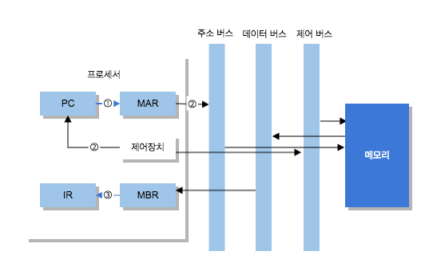
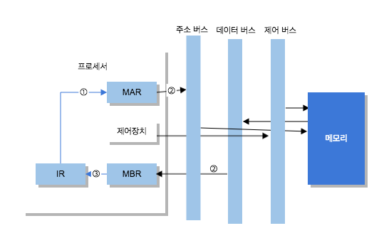
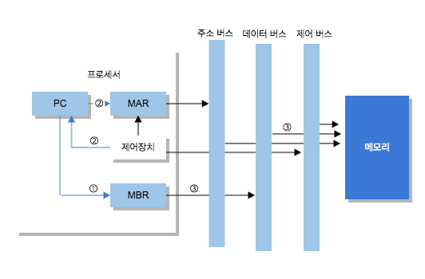

# 컴퓨터 시스템의 구성  
 컴퓨터 시스템은 프로세서, 메모리(기억장치), 주변장치의 하드웨어hardware와 명령어로 작성한 프로그램인 소프트웨어software로 구성. 이런 구성 요소는 컴퓨터의 주 기능인 프로그램을 실행하려고 **버스**로 **상호 연결**되어 있다.  

# 프로세서processor의 개념    
 - 컴퓨터 하드웨어에 부착한 모든 장치의 동작을 제어하고 명령을 실행, 연산을 수행한다.  
 - 중앙처리장치CPU, Central Processing Unit라고도 함.(더 하드웨어적인 표현)  

# 프로세서의 구성    
 - 연산장치, 제어장치, 레지스터로 구성, 그리고 서로를 내부 버스로 연결  

 
# 레지스터  
 - 프로세서 내부에서 극히 소량의 데이터나 처리중인 중간 결과를 일시적으로 기억해 두는 고속의 전용 영역    
 - 용도에 따라 전용과 범용으로 구분하고, 저장하는 정보의 종류에 따라 데이터 레지스터, 주소 레지스터, 상태 레지스터로 세분화  
 - 정보의 변경 여부에 따라 사용자 가시 레지스터, 사용자 불가시 레지스터로 구분  
 - [표 4-3 레지스터의 종류](http://terms.naver.com/entry.nhn?docId=2270367&cid=51173&categoryId=51173)  

# 메모리의 종류  
 - 속도는 느리지만 저장 용량이 큰 자기디스크, 광디스크, 자기테이프 등 보조기억장치  
 - 프로세서 외부에 있으면서 프로세서에서 수행할 프로그램과 데이터를 저장하거나 프로세서에서 처리한 결과를 저장하는 메인 메모리  
 - 프로세서 내부나 외부에 있으면서 처리 속도가 빠른 프로세서와 상대적으로 속도가 느린 메인 메모리의 속도 차이를 보완하는 고속 버퍼의 캐시  
 - 속도는 가장 빠르지만 용량이 작은 레지스터   

> 기술이 발달하면서 SSDSolid State Disk, NVRAMNon-Volatile RAM등도 등장. SSD는 플래시 메모리로 구성되있으며 HDD보다 데이터 입출력 속도가 빠름. 하지만 용량이 작고 가격이 비싸다. NVRAM은 외부 전원이 꺼지거나 상실되더라도 내용은 보존하는 RAM이다.  

  
# 메모리의 계층 구조  

 여러 계층의 메모리를 연결해 비용, 속도, 용량, 접근시간 등을 상호 보완한 계층적 메모리 구조를 메모리 계층 구조라 한다.   

   

 
# 시스템 버스  
 - 하드웨어를 물리적으로 연결해 서로 데이터를 주고받을 수 있게 하는 통로 
 - 컴퓨터 내부의 다양한 신호(데이터 입출력 신호, 프로세서 상태 신호, 인터럽트 요구와 허가 신호, 클록clock 신호 등)를 시스템 버스로 전달  
 - 기능에 따라 데이터 버스, 주소 버스, 제어 버스로 구분  

 | 종류 | 설명 |  
 | --- | --- |  
 | 데이터 버스 | 프로세서와 메인 메모리, 주변장치 사이에서 데이터를 전송. 배선 수는 프로세서가 한 번에 전송할 수 있는 비트 수(워드)를 결정 |  
 | 주소 버스 | 프로세서가 시스템의 구성 요소를 식별하는 주소 정보를 전송. 배선 수는 프로세서와 접속할 수 있는 메인 메모리의 최대 용량을 결정 |  
 | 제어 버스 | 프로세서가 시스템의 구성 요소를 제어하는 데 사용. 제어 신호로 연산장치의 연산 종류와 메인 메모리의 읽기나 쓰기 동작을 결정 |  

# 주변 장치  
 - 프로세서와 메인 메모리를 제외한 나머지 하드웨어 구성 요소  
 - 단순히 입출력장치라고도 하는데, 크게 입력장치, 출력장치, 저장장치로 구분  
 
# 명령어 구조  
 - 명령어는 사용자가 원하는 연산과 오퍼랜드(피연산자), 처리 순서를 프로세서에 지시하는 것.  
 - 연산 부호OPcode와 명령어가 처리할 데이터, 데이터가 저장된 레지스터나 메모리 주소인 피연산자operand로 구성  

| 연산 부호 | 피연산자1 | 피연산자2 | ... | 피연산자 n |  
| --- | --- | --- | --- | --- |

명령어의 기본 구조    

 - 명령어에 피연산자의 위치를 명시하는 방법을 나타내는 **모드 비트**mode bit I를 추가하거나, 다음 명령어의 위치를 나타내는 주소를 추가할 수도 있다.  
 - 피연산자에 데이터가 있는 레지스터나 메모리 주소를 지정하면 **직접 주소**direct address, 데이터가 있는 레지스터나 메모리 주소 정보를 지정하면 **간접 주소**indirect address  

   

# 명령어 실행  
- 명령어는 컴퓨터 시스템의 메모리에 보관  
- 한 번에 한 개씩 프로세서로 전송하면서 해석, 실행  
- 명령어는 명령어 인출과 명령어 실행 주기의 반복 처리로 실행  
 
- 실행 과정  
 1. 명령어 인출  
   명령어 레지스터에 저장된 다음 명령어를 인출  
 2. 명령어 해석, 프로그램 카운터 변경  
   인출한 명령어를 해석, 다음 명령어를 지정하려고 프로그램 카운터를 변경  
 3. 피연산자 인출  
   명령어가 메모리에 있는 워드를 한 개 사용하려면 사용 장소를 결정해 피연산자를 인출하고, 필요하면 프로세서 레지스터로 보낸다.  
 4. 명령어 실행  
 5. 결과 저장  
 6. 다음 명령어로 이동   
   다음 명령어의 1단계부터 다시 시작  

- 명령어 실행 사이클은 인출 사이클, 간접 사이클, 실행 사이클, 인터럽트 사이클로 구성  

## 인출 사이클fetch cycle

- 명령어 실행 사이클의 첫 번째 단계  
- 메모리에서 명령어를 읽어 명령어 레지스터에 저장하고 다음 명령어를 실행하려고 프로그램 카운터를 증가 시킴.  
- 인출 사이클에 소요되는 시간을 인출 시간이라고 함.  
- 인출 사이클 과정  
     

 | 시간 | 레지스터 동작 | 설명 | 
 | --- | --- | --- | 
 | ① | PC → MAR | PC에 저장된 주소를 프로세서 내부 버스를 이용해 MAR에 전달  | 
 | ② | MemoryMAR → MBR | MAR에 저장된 주소에 해당하는 메모리 위치에서 명령어 인출 후 이 명령어를 MBR에 저장 | 
 |   | PC + 1 → PC | 다음 명령어를 인출하려고 PC를 증가시킴 |  
 | ③ | MBR → IR | MBR에 저장된 내용을 IR에 전달 |
    
 - PC: 프로그램 카운터  
 - MAR: 메모리 주소 레지스터  
 - MBR: 메모리 버퍼 레지스터  
 - IR: 명령어 레지스터  

## 실행 사이클execution cycle  
 - 인출한 명령어를 해독, 그 결과에 따라 제어 신호를 발생시켜 명령어를 실행  
 - 여기서 소비되는 식나을 실행 시간이라함.  

## 간접 사이클indirect cycle  
- 직접 주소 지정 방법을 사용하는 실행 사이클은 명령어를 즉시 수행하지만 간접 주소 지정 방법을 사용하는 실행 사이클은 **명령어를 수행하기 전에 실제 데이터가 저장된 주기억장치의 주소인 유효 주소를 한 번 더 읽어 온다**.    
- 간접 사이클 과정
   

 | 시간 | 레지스터 동작 | 설명 |  
 | --- | --- | --- |  
 | ① | IRaddr → MAR | IR에 저장된 명령어의 피연산자(주소부)를 MAR에 전달  |  
 | ② | MemoryMAR → MBR | MAR에 저장된 주소에 해당하는 메모리 위치에서 명령어 인출 후 이 명령어를 MBR에 저장 |  
 |   | PC + 1 → PC | 다음 명령어를 인출하려고 PC를 증가시킴 |   
 | ③ | MBR → IRaddr | MBR에 저장된 내용을 IR에 전달 |  

## 인터럽트 사이클  
- 인터럽트: 프로세서가 프로그램을 수행하는 동안 컴퓨터 시스템 내부나 외부에서 발생하는 예기치 못한 사건을 의미  
- 프로세서는 실행 사이클 완료 후 인터럽트 요구가 있는지 검사  
  - 인터럽트 요구가 없으면 다음 명령어를 ㅇ니출  
  - 인터럽트 요구가 있으면 현재 수행 중인 프로그램의 주소(프로그램 카운터) 값을 스택이나 메모리의 0번지 같은 특정 장소에 저장  
  - 프로그램 카운터에는 인터럽트 처리 루틴의 시작 주소를 저장해 두었다가 인터럽트 처리를 완료하면 중단된 프로그램으로 복귀해서 계속 수행  
- 인터럽트 사이클 과정  
   

 | 시간 | 레지스터 동작 | 설명 | 
 | --- | --- | --- | 
 | ① | PC → MBR | PC의 내용을 MBR에 저장  | 
 | ② | IntRoutine_Address → PC | 인터럽트 루틴 주소를 PC에 저장 | 
 |   | Save_Address → MAR | PC에 저장된 인터럽트 루틴 주소를 MAR에 저장 |  
 | ③ | MBR → MemoryMAR | MBR의 주소에 있는 내용을 지시된 메모리 셀로 이동 |  

# 인터럽트 

- 현재 실행 중인 프로그램의 수행을 연기하고 다른 프로그램의 수행을 요구하는 명령  
- 시스템의 처리 효율을 향상, 프로그램이 실행 순서를 바꿔 가면서 처리하여 **다중 프로그래밍에 사용**   
