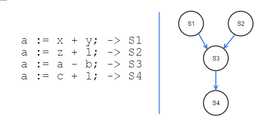

# 병행 프로세스와 상호배제  

## 병행 프로세스   
 **프로세서 하나가 여러 프로세스를 동시에 실행하는 것처럼 보이는 것**을 병행 프로세스라고 한다. 병행 프로세스는 서로 독립적으로 작업을 수행하는 단일 처리 시스템에서 **독립 프로세스**, 다른 프로세스와 협력하면서 특정 기능을 수행하는 비동기적 프로세스인 **협력 프로세스**로 구분한다.  

## 병행 프로세스의 해결 과제  
 시스템의 신뢰도를 높이고 처리 속도를 개선하여 처리 능력을 향상시키려면 공유 자원을 상호배타적으로 사용해야 한다. 어떤 프로세스가 작업을 실행 중일 때 나머지 프로세스는 그 작업에 관련된 작업을 수행할 수 없도록 상호배제와 동기화를 해야 한다. 프로세스는 동시에 수행하는 다른 프로세스의 실행 속도와 관계없이 항상 일정한 실행 결과를 보장하도록 결정성을 확보해야 한다. 특히 교착 상태를 해결하고 병행 프로세스들의 병렬 처리 능력을 극대화해야 한다.  

## 선행 그래프와 병행 프로그램  
 선행 그래프는 선행 제약을 논리적으로 표현한 것으로, 순차적 활동을 표현하는 방향성 비순환 그래프이다. 선행 그래프는 연산의 선행 제약을 정의하는 데 유용하다. 하지만 2차원이라 프로그램에 사용하기가 어려워 fork와 join 구조, 병행 문장<sup>parbegin/parend</sup>을 제시했다.    

### 선행 그래프  
 노드 i에서 노드 j로 활동 j를 시작하기 전에 활동 i를 완료해야 한다는 순차적 활동을 표현하는 방향성 비순환 그래프. 여기서 노드는 소프트웨어 작업이거나 동시에 실행할 수 있는 프로그램 명령일 수 있음.  

   

- S1과 S2는 서로 독립적이므로 동시에 수행 가능  
- S3은 a값과 b값을 할당받기 전에 수행하면 안 된다.  
- S4는 c값을 계산하기 전에 수행할 수 없다.  


### fork와 join 구조  
- `fork L` 문장을 사용하면 병행 프로세스를 2개 만든다.  
 - 하나는 레이블이 L인 문장에서 수행을 시작, 다른 하나는 fork 명령 바로 다음 문장에서 시작  
- join 명령은 병행 연산 2개를 하나로 결합하는 방법을 제공  

### 병행 문장  

```
parbegin S1;S2;......;Sn;parend;
```
- 각 S<sub>i</sub>는 단일 문장이고, parbegin과 parend 사이의 모든 문장은 병행 수행이 가능  

## 상호배제와 동기화  

 **상호배제**는 병행 프로세스에서 프로세스 하나가 공유 자원을 사용할 때 다른 프로세스들이 동일한 일을 할 수 없도록 하는 방법  
공유 자원을 동시에 사용하지 못하게 실행을 제어하는 방법을 동기화라고 하는데, 동기화는 순차적으로 재사용 가능한 자원을 공유하려고 상호작용하는 프로세스 사이에서 나타난다. 동기화로 상호배제를 보장할 수는 있지만, 이 과정에서 교착 상태와 기아 상태가 발생할 수 있다.   

- 임계 자원: 두 프로세스가 동시에 사용할 수 없는 공유 자원  
- 임계 영역: 임계 자원에 접근하고 실행하는 프로그램 코드 부분  

## 상호배제의 방법  

- **데커의 알고리즘**<sup>Decker's algorithm</sup>: 병행 프로그래밍의 상호배제 문제를 풀 수 있는 첫 번째 해결책. 두 프로세스가 서로 통신하려고 공유 메모리를 사용하여 충돌 없이 단일 자원을 공유할 수 있도록 허용한다.  
- **TestAndSet**<sup>TAS</sup>(테스)명령어: 소프트웨어적인 해결책은 더 복잡하고 프로세스가 2개 이상일 때는 더 많이 대기할 수 있기 때문에 이ㄷ때 기계를 비교하거나 단어 내용을 검사, 수정하는 특별한 하드웨어 명령어(TestAndSet)를 사용해 간단한 방법으로 임계 영역 문제를 해결 가능하다.  
- **세마포**<sup>semaphore</sup>: 상호배제의 해결책에는 바쁜 대기로 프로세스를 낭비한다는 단점이 있음. 다익스트라는 진입 조건을 반복 조사하지 않고 true일 때 프로세스 상태를 확인하는 새로운 동기화 도구인 세마포를 제안해 이 문제를 해결. 세마포는 상호배제에 사용할 뿐만 아니라 다양한 연산의 순서도 제공  
- **모니터**<sup>monitor</sup>: 세마포를 잘못 사용하면 여러 가지 오류가 쉽게 발생해 프로그램을 작성하기 어려움. 이런 단점을 극복하려고 모니터가 등장. 공유 자원과 이것의 임계 영역을 관리하는 소프트웨어 구성체로, 병행 프로그래밍 구조이다.   


