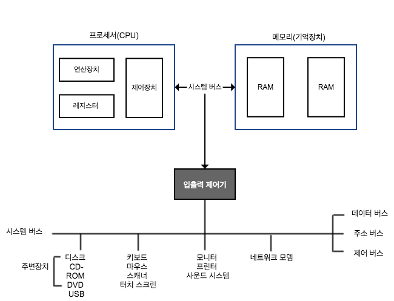

# 컴퓨터 하드웨어의 구성  

- 컴퓨터 시스템: **하드웨어**(데이터를 처리하는 물리적 기계장치) + **소프트웨어**(어떤 작업을 지시하는 명령어로 작성한 프로그램)  
- 운영체제 OS, Operating System: 컴퓨터 하드웨어를 관리하는 소프트웨어  
- 컴퓨터 하드웨어는 크게 **프로세서, 메모리(기억장치), 주변장치**로 구성. 이들을 **시스템 버스**로 연결  
- **컴퓨터 하드웨어의 구성**  
   

## 프로세서 Processor  

- 컴퓨터 하드웨어에 부착한 모든 장치의 동작을 제어, 명령을 실행  
- 중앙처리장치CPU, Central Processing Unit라고도 함.  
 - 중앙처리장치: 하드웨어적 관점  
 - 프로세서: 소프트웨어적 관점  
- 연산장치, 제어장치, 레지스터로 구성. 이들을 내부 버스로 연결  

## 레지스터  

- 종류  
 - 용도  
   - 전용 레지스터  
    - 범용 레지스터  

 - 사용자 가시: 사용자가 정보를 변경할 수 있는가?  
   - 사용자 가시user-visible 레지스터    
    - 사용자 불가시user-invisible 레지스터    

 - 저장하는 정보의 종류  
   - 데이터 레지스터  
   - 주소 레지스터  
   - 상태 레지스터  

