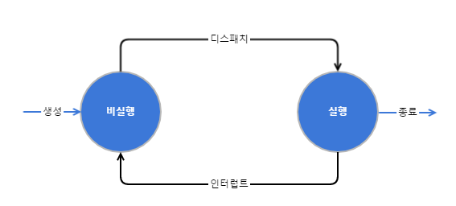
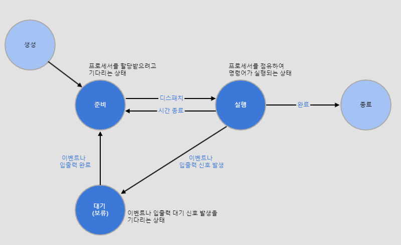

# 프로세스와 스레드  

## 프로세스의 개념  
 프로세스의 가장 일반적인 정의는 '**실행 중인 프로그램**'이다. 프로그램은 컴파일한 코드와 초기화 전역변수, 문자열과 문자열 상수 등 적적 데이터를 포함하는 정적인 개체이다. 반면에 **프로세스는 스택, 힙 데이터와 코드 영역으로 구성된 메모리 구조와 프로그램 카운터나 레지스터처럼 현재 어떤 자원을 사용하는지 관련 정보가 들어 있는 동적인 개체**이다.  
- 다음과 같이 다양하게 정의  
 - 실행 중인 프로그램  
 - 비동기적asynchronous 행위  
 - 실행 중인 프로시저  
 - 실행 중인 프로시저의 제어 추적  
 - 운영체제에 들어 있는 프로세스 제어 블록PCB  
 - 프로세서에 할당하여 실행할 수 있는 개체 디스패치dispatch가 가능한 대상   
- 프로시저: 일반적인 어떤 행동을 수행하기 위한 일련의 작업순서를 말하는데, 프로그래밍에서는 루틴이나 서브루틴 및 함수와 같은 뜻이다. 하나의 프로시저는 특정 작업을 수행하기 위한 프로그램의 일부이다.  
- 스택: 데이터를 일시적으로 저장하는 영역  
- 힙: 코드 영역과는 별도로 유지되는 자유 영역. 동적으로 메모리를 할당하려고 프로그램 실행 중 시스템 호출을 사용했다가 해제하는 방법으로 활용  
- 데이터: 프로그램의 가상 주소 공간. 전역변수나 정적변수를 저장하거나 할당하고 실행하기 전에 초기화한다.  
- 코드: 실행 명령을 포함하는 메모리이거나 목적 파일에 있는 프로그램 영역  

## 프로세스의 상태  
 프로세스의 상태는 프로세스의 현재 활동으로 정의한다. 프로세스의 상태는 **크게 실행과 비실행 상태**로 구분할 수 있고 **준비, 실행, 대기 등으로 더 세분화**할 수 있다.    
- 프로세스의 상태  
  
  

- 프로세스의 상태 변화   
  

- 디스패처: 스케줄러가 선택한 프로세스에 프로세서를 할당하는 모듈. 디스패처가 준비 상태인 프로세스에 프로세서를 할당하면 다시 실행 상태로 바뀐다.  

## 프로세스 제어 블록  
 프로세스 제어 블록PCB, Process Control Block은 **특정 프로세스 정보를 저장하는 데이터 블록이나 레코드**이다. 프로세스가 생성되면 메모리에 프로세스 제어 블록을 생성하고, 프로세스가 실행을 종료하면 해당 프로세스 제어 블록도 삭제한다.   

- **PCB에 들어 있는 정보**
 - **프로세스 식별자**: 각 프로세서의 고유 식별자(숫자, 색인 항목)  
 - **프로세스 상태**: 생성, 준비, 실행, 대기, 중단 등 상태 표시  
 - **프로그램 카운터**: 프로세스를 실행하는 다음 명령의 주소 표시  
 - **레지스터 저장 영역**: 누산기, 인덱스 레지스터, 스택 포인터, 범용 레지스터, 조건 코드 등 정보로, 인터럽트가 발생하면 프로그램 카운터와 함께 저장하여 재실행할 때 원래대로 복귀할 수 있게 한다.  
 - **프로세서 스케줄링 정보**: 프로세스의 우선순위, 스케줄링 큐의 포인터, 기타 스케줄 매개변수  
 - **계정 정보**: 프로세서 사용 시간, 실제 사용 시간, 사용 상한 시간, 계정 번호, 작업이나 프로세스 번호 등  
 - **입출력 상태 정보**, 메모리 관리 정보 등...

## 프로세스 문맥 교환  
 프로세스 문맥 교환은 **인터럽트나 시스템 호출 등으로 실행 중인 프로세스의 제어를 다른 프로세스에 넘겨 실행 상태가 되도록 하는 것**이다.   
- 문맥 교환의 예  
  

 

## 프로세스의 구조  
 프로세스는 실행 중에 새로운 프로세스를 생성할 수 있다. 프로세스를 새로 생성하는 프로세스는 부모 프로세스parent process이고, 생성되는 프로세스는 자식(서브) 프로세스child process이다. 이때 프로세스 생성 순서를 저장하고 부모-자식 관계를 유지하여 계층적으로 생성한다.  

## 프로세스의 생성  
 프로세스를 생성하면 운영체제는 해당 프로세스에서 프로세스 제어 블록을 만들어 주소 공간을 할당한다. 일괄 처리 환경에서는 준비 큐에 작업이 도착할 때 프로세스를 생성하고, 대화형 환경에서는 새로운 사용자가 로그온log-on할 때 프로세스를 생성한다.  

## 프로세스의 종료  
 프로세스가 마지막 명령을 실행하면 종료한다. 일괄 처리 환경에서는 작업 종료를 의미하는 신호로 인터럽트를 발생하거나 시스템 호출로 중단 명령을 전달하여 프로세스를 종료한다. 대화형 환경에서는 사용자가 로그오프log-off하거나 터미널을 닫으면 프로세스를 종료한다. 이외에도 오류로 프로세스를 종료할 수 있다.   
- 프로세스 종료의 종류  
 - **정상 종료**: 프로세스가 운영체제의 서비스를 호출할 때  
 - **시간 초과**: 프로세스가 명시된 전체 시간을 초과하여 실행하거나 명시된 시간을 초과하면서 어떤 이벤트 발생을 기다릴 때  
 - **실패**: 파일 검색 실패, 입출력이 명시된 횟수를 초과하여 실패할 때  
 - 산술 오류, 보호 오류, 데이터 오류 등  
 - 메모리 부족, 액세스 위반 등  

## 프로세스의 제거  
 프로세스 제거는 프로세스를 파괴하는 것이다. 프로세스를 제거하면 사용하던 자원을 시스템에 돌려주고, 해당 프로세스는 시스템 리스트나 테이블에서 사라져 PCB을 회수한다. 자식 프로세스는 부모 프로세스를 제거하면 자동으로 제거된다.  

## 프로세스의 중단과 재시작  
 다중 프로그래밍 환경에서도 프로세서의 유휴시간이 발생한다. 입출력 동작이 일반 연산보다 느려 유휴 상태가 되거나 프로세서의 동작시간이 입출력보다 짧아 프로세스 문맥 교환이 일어난 후에도 기다리게 되어 유휴시간이 발생한다. **유휴시간 문제는 프로세스 중단(일시정지) 상태를 이용하여 해결할 수 있다.** **중단 원인을 제거하여 다시 실행하는 것을 재시작**이라고 한다.   

- 프로세스 중단이 발생하는 상황  
 - 시스템 장애가 발생하면 실행 중인 프로세스는 잠시 중단했다가 시스템이 기능을 회복할 때 다시 재시작.  
 - 프로세스에 의심스러운 부분이 있으면 실행 중인 프로세스를 중단하여 확인한 후 재시작하거나 종료  
 - 처리할 작업이 너무 많아 시스템에 부담이 되면(너무 많은 적재) 프로세스 몇 개를 중단했다가 시스템이 정상 상태로 다시 돌아왔을 때 재시작  

## 프로세스의 우선순위 변경  
 PCB의 우선순위 값을 변경할 수 있고, 프로세스 스케줄러는 준비 리스트의 우선 순위를 이용해 프로세스를 처리한다.  

## 프로세스 문맥 교환  
 **이전 프로세스의 상태 레지스터 내용을 보관하고 다른 프로세스의 레지스터를 적재하여 프로세스를 교환**하는데, 이런 일련의 과정을 **문맥 교환context switching**이라고 한다.    
 보통 인터럽트가 발생하면 인터럽트 처리 루틴으로 제어가 넘어간 후에도 시스템 관리와 관련된 기본 작업을 하고 인터럽트 유형에 따라 관련 루틴으로 분기  
 - **입출력 인터럽트**: 입출력 동작이 발생했음을 확인하고 이벤트를 기다리는 프로세스를 준비 상태로 바꾼 후 실행할 프로세스를 결정  
 - **클록 인터럽트**: 현재 실행 중인 프로세스의 할당 시간을 조사하여 실행 중인 프로세스를 준비 상태로 바꾸고, 다른 프로세스를 실행 상태로 바꾼다.  

## 스레드의 개념  
 프로세스는 두 가지 특성인 자원과 제어로 구분할 수 있는데, 제어만 분리한 실행 단위를 스레드thread라고 한다. 프로그램 카운터PC와 스택 포인터SP 등을 비롯한 스레드 실행 환경 정보(문맥 정보), 지역 데이터, 스택을 독립적으로 가지면서 코드, 전역 데이터, 힙을 다른 스레드와 공유한다.  

## 단일 스레드와 다중 스레드  
 스레드가 한 개인 단일 스레드와 스레드가 여러 개인 다중 스레드로 구분. 다중 스레드는 프로그램 하나를 여러 실행 단위로 쪼개어 실행한다는 측면에서 다중 처리(멀티 프로세싱)와 의미가 비슷하다. 하지만 동일 프로세스의 스레드는 자원을 공유하므로 자원 생성과 관리의 중복성을 최소화하여 실행 능력을 향상시킬 수 있다.  

## 스레드 사용 방법  
 스레드를 사용자 수준에서 적용할 수 있고, 프로그램의 비동기적 요소를 구현하는 데 사용할 수도 있다. 실행 중인 스레드를 대기 상태로 바꾸고 제어를 다른 스레드로 옮기는 상태 변화를 이용해 많은 요청을 효과적으로 처리할 수도 잇다. 데이터베이스 시스템에서도 스레드 활용이 가능하다.   

- 비동기적 요소를 구현한 예  
 워드 편집기. 이미지나 텍스트를 보여 주는 스레드, 사용자의 키 입력에 응답하는 스레드, 지정된 시간에 디스크에 저장하는 정기적인 백업 스레드 등으로 구성이 가능.  

## 스레드의 상태  
 스레드도 프로세스처럼 준비, 실행, 대기, 종료 상태로 구분한다. 한 프로세스에 있는 스레드는 순차적으로 실행하며, 해당 스레드의 정보를 저장하는 레지스터와 스택이 있다.  

## 스레드 제어 블록  
 스레드 제어 블록은 프로세스 제어 블록과 같은 레지스터 값, 프로그램 카운터, 스택 포인터, 스케줄링 상태 외에도 스레드 ID와 해당 스레드를 포함하는 프로세스 포인터 같은 특정 값도 저장한다.  

## 스레드의 구현  
 사용자 수준 스레드는 스레드 라이브러리를 이용해 작동하고, 사용자 영역에 있는 스레드 여러 개가 커널 영역의 스레드 한 개에 다대일(n:1)로 매핑된다. 커널 수준 스레드는 커널(운영체제)에서 지원하고, 사용자 영역 스레드별로 커널 영역 스레드가 일대일(1:1)로 매핑된다. 이 둘을 혼합한 형태가 혼합형 스레드로 사용자 영역에서 스레드를 생성하고, 다수의 사용자 수준 스레드에 다수의 커널 스레드가 다대다(n:m)로 매핑된다.  