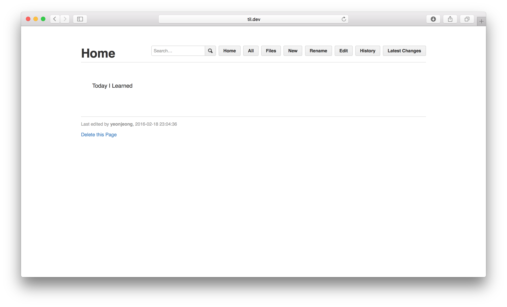

# TIL 로컬에 띄우기  

## gollum 설치  

### Ruby와 RubyGems 설치  

- Mac의 10.5 Leopard 버전 이상에서는 ruby가 이미 포함되어 있다. Homebrew를 사용해 새로운 버전의 ruby를 얻는다.  
 [Homebrew 설치](brew.sh)   

- 새 버전의 ruby 받기   
  ```
  $ brew install ruby
  ```  

- gollum 설치  
 ```
 $ gem install gollum
 ```  


 ## pow 설치
 ```
 $ curl get.pow.cx | sh
 ```

## 사용법  
다음 설정을 하고 브라우저에서 http://til.wiki.dev/로 접속한다.
```
$ cd ~/.pow
$ ln -s repo명 til.wiki
```



## Anvil 설치

GUI pow 관리툴 Anvil http://anvilformac.com/
