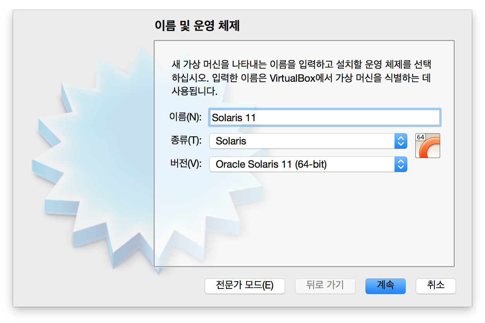
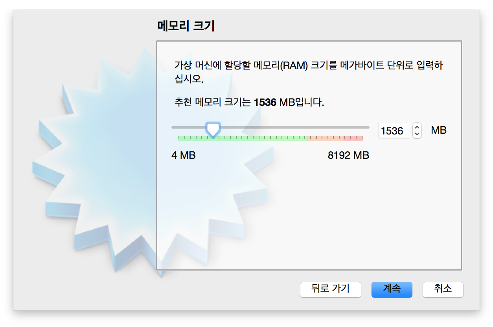
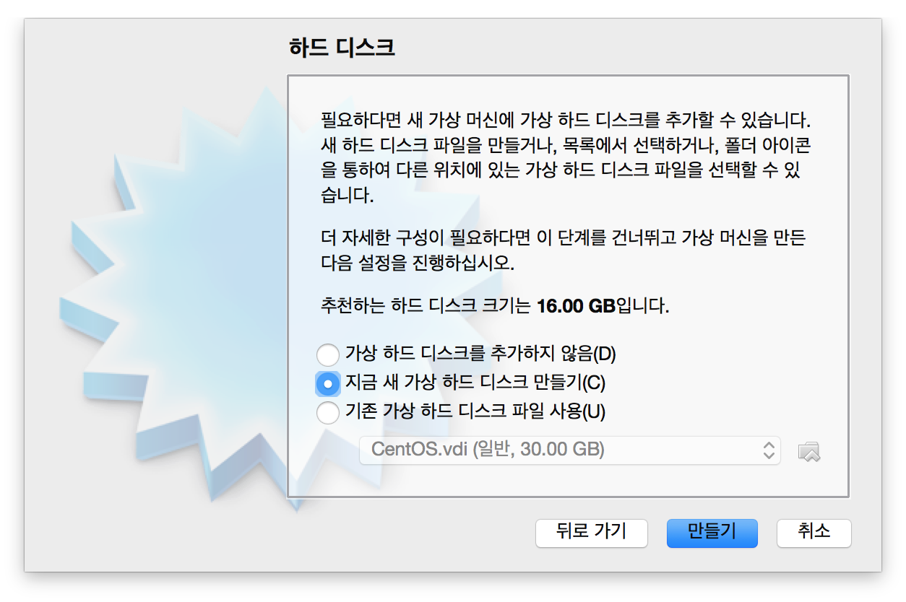
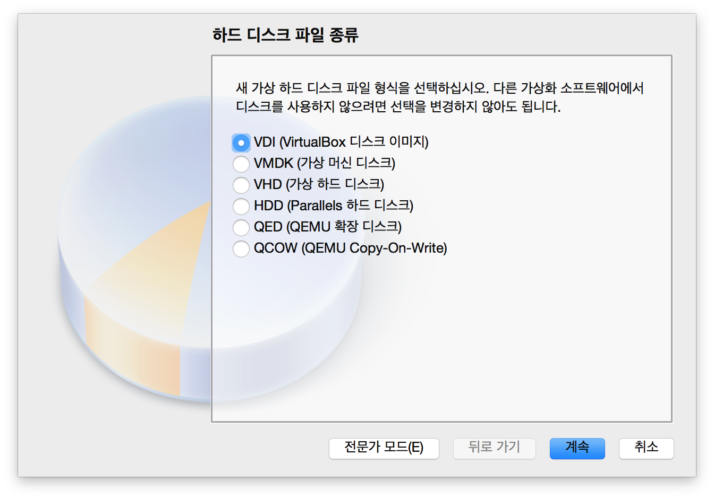
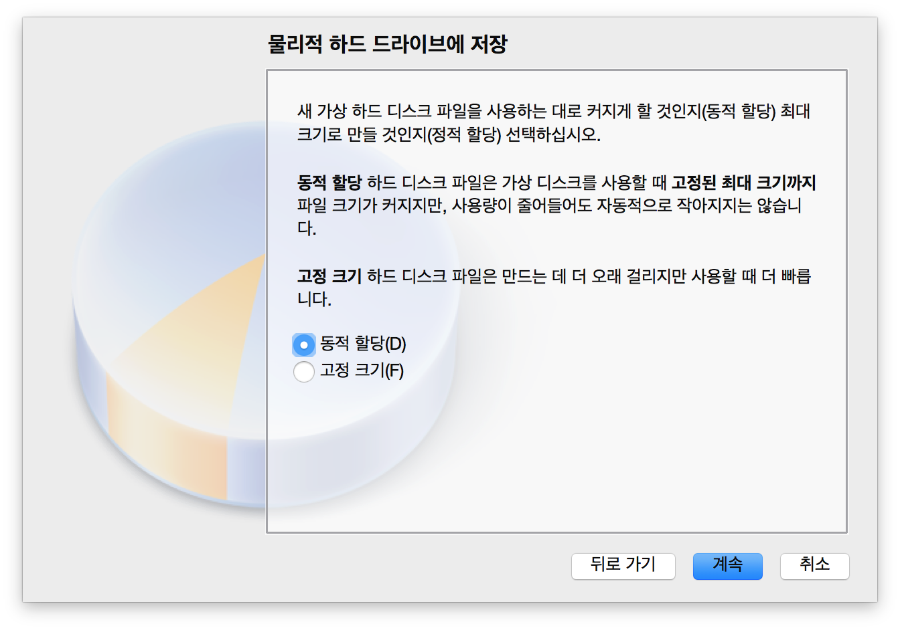
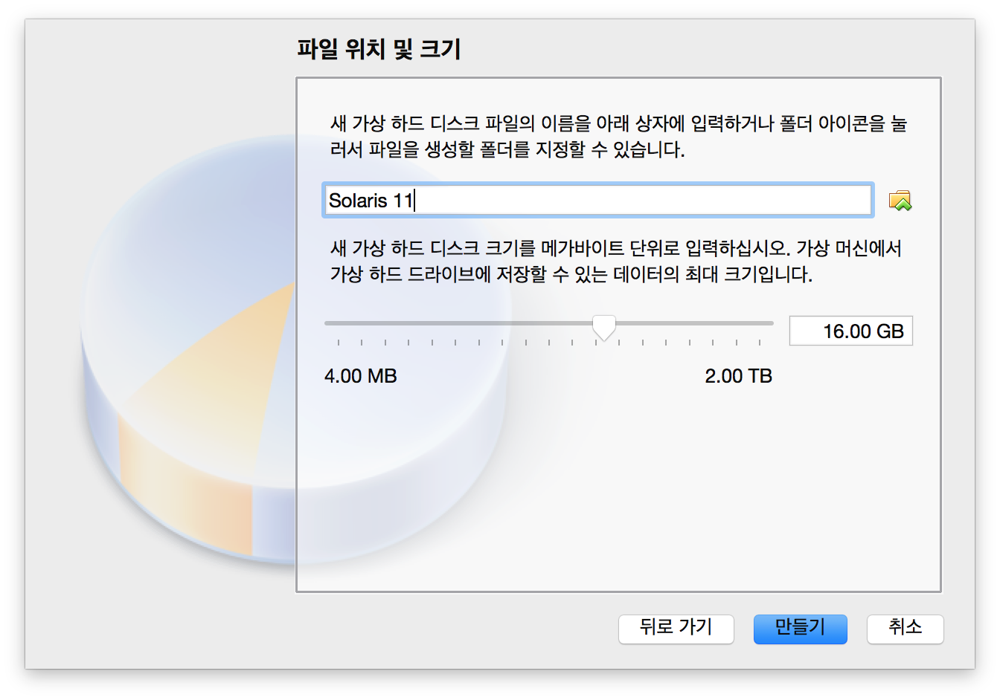

# 솔라리스 11 설치  

## Oracle VM VirtualBox 다운로드  

https://www.virtualbox.org/  

## Oracle Solaris 11 다운로드  

Oracle Solaris 11 설치는 크게 두 가지가 있다.   

- Oracle Solaris 11 Text - CLI 기반의 서버용으로 사용  
- Oracle Solaris 11 Live - GNOME GUI 기반의 데스크탑용으로 사용    

### Oracle Solaris 11 Text의 설치  

http://www.oracle.com/technetwork/server-storage/solaris11/downloads/index.html 에서 Installation from CD/DVD or USB를 클릭해 **x86 Text Installer** 다운로드  

## Oracle VM VirtualBox에서 가상컴퓨터 생성  

<새로 만들기> 버튼 클릭  

가상 머신 이름을 지정하고 종류는 **Solaris**, 버전은 **Oracle Solaris 11 (64bit)**   
  

Solaris 11의 최소 권장 메모리는 1.5GB  
  

가상 하드 드라이브 새로 만든다.  
  

가상 하드 드라이브 파일은 VirtualBox 기본 디스크 이미지인 VDI를 선택  
  

디스크 공간을 효율적으로 사용하기 위해 동적 할당을 선택  
  

가상 하드 드라이브 파일 이름과 크기를 지정하고 만들기  
  

가상 머신 구성 완료 화면에서 설정-저장소를 눌러 광학드라이브-디스크 모양 아이콘-Solaris 11 ISO 이미지를 삽입 - 확인  

## Solaris 11 설치  

<kbd>F2</kbd>키를 눌러 진행 한다.  

