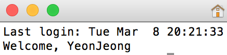

# Learn the Command Line - environment  

터미널 애플리케이션을 실행할 때마다, 새로운 세션이 만들어진다. 세션은 즉각적으로 세팅과 설정들을 불러오고 커맨드 라인 환경을 참조한다. 
만든 명령어와 프로그램을 위한 환경 설정을 할 수 있다. 이것은 인사말과 명령어 단축을 가능하게 한다. 그리고 명령어와 프로그램 사이에 공유하기 위한 변수를 만들 수 있다.  
  


## nano

nano는 커맨드 라인 텍스트 에디터이다. 다음과 같이 불러올 수 있다.
```
$ nano hello.txt
```

TextEdit나 Notepad 같은 기능을 한다. 하지만 커맨드 라인에서만 접속이 가능하고 입력은 키보드 밖에 없다.   
1. 명령어 `nano hello.txt`는 **hello.txt**라는 새로운 텍스트 파일 nano 텍스트 에디터에서 연다.   
2. 커서를 통해 "Hello, I am nano"를 입력한다.  
3. 맨 아래에 키보드 명령어 메뉴가 있는데 수정, 저장, 종료를 할 수 있다. 여기서 `^`는 Ctrl 키를 의미한다.  
  
4. <kbd>Ctrl</kbd> + <kbd>O</kbd>는 파일을 저장한다. 'O'는 output을 의미한다.  
5. <kbd>Ctrl</kbd> + <kbd>X</kbd>는 nano 프로그램을 종료한다. 'X'는 exit을 의미한다.  
6. <kbd>Ctrl</kbd> + <kbd>G</kbd>는 help menu를 연다.  
7. `clear`는 터미널 창을 깨끗이 지운다. 명령어 prompt를 맨 위로 올려준다.    

[nano 더 자세한 정보](http://www.nano-editor.org)  

## Bash Profile   
```
$ nano ~/.bash_profile
```
**~/.bash_profile**라는 파일은 환경 설정을 저장할 때 사용한다. 보통 "bash profile"이라 부른다. 세션이 시작될 때, 명령이 종료되기 전에 bash profile에 있는 내용들이 불러와진다.  
- `~`은 사용자의 홈 디렉토리를 나타낸다.  
- `.`는 숨김 파일을 표시한다. 
- **~/.bash_profile** 이름은 중요하다. 어떻게 커맨드 라인이 bash profile을 이해하는지 나타내기 때문이다.  

1. `nano ~/.bash_profile`은 nano에서 **~/.bash_profile** 을 연다.  
2. `echo "Welcome, Jane Doe"`은 bash profile에 인사말을 만들고 저장되는데 터미널 세션이 시작되면 이 문자열이 커맨드 라인에 나오게 된다.   
  
실제로 해봤다. 내 이름을 넣고...  

3. `source ~/.bash_profile` 명령은 현재 세션에서 **~/.bash_profile**의 변화를 작동한다. 터미널을 종료하고, 새로 세션을 시작할 필요 없이 말이다. `source`는 현재 있는 세션에서 수정을 즉시 적용한다. 이 부분을 읽지 않고 바보같이 터미널을 나는 껐다가 켰다.  

## Aliases  

```
alias pd="pwd"
```
`alias` 명령은 자주 사용하는 명령어를 위해 키보드 단축키 또는 별명을 만들게 해준다. 
1. `alias pd="pwd"`는 `pwd`명령을 위해 'pd'라는 별명을 만들어주고, bash profile에 저장된다. 이제 `pd`를 입력할때마다 `pwd` 명령과 같은 결과가 나오게 된다. 

## Environment Variables

다시 nano 에디터로 **~/.bash_profile**을 열고 다음과 같이 입력한다.  
```
export USER="Jane Doe"
```  

```
echo $USER  
Jane Doe
```
environment variables(환경 변수)는 명령어와 프로그램 사이에서 사용되는 변수이다. 그리고 환경에 대한 정보를 쥐고 있다.   

1. `USER="Jane Doe"`는 환경변수 USER를 "Jane Doe"로 지정해준다. 보통 USER 변수는 컴퓨터의 주인 이름으로 설정해준다. 
2. `export`는 현재 속해 있는 세션으로 부터 그 아래의 모든 자식 세션들에게 변수를 초기화가 가능하게 해준다. 이것이 변수가 프로그램을 가로질러 지속되는 방법이다.   
3. 커맨드 라인에서, `echo $USER` 명령은 변수의 값을 반환하는 것이다. `$`는 항상 변수의 값을 불러올 때 사용된다는 것에 주목해야 한다.   

## PS1  

nano 에디터에서 **~/.bash_profile**을 열고 다음과 같이 입력한 뒤 저장한다.  
```
export PS1=">> "
```  
그러고 `source ~/.bash_profile`입력 후 아무 명령어나 쳐보면 프롬프트의 모양이 다음과 같이 달라진 것을 알 수 있다.  
```
>> echo "hello"                                                                                  
hello  
```  

`PS1`라는 변수는 명령 프롬프트의 스타일을 정의한다.  
1. `export PS1=">> "`는 명령 프롬프트의 변수를 설정한다. `$`에서 `>> `로 바뀐 것이다. 
`source` 명령 사용 후, 커맨드 라인이 새로운 명령 프롬프트로 바뀐 것을 알 수 있다.   

## HOME  
```
$ echo $HOME                                                                                     
/home/ccuser 
```  
`HOME` 변수는 환경 변수인데 홈 디렉토리의 주소를 보여준다. 위와 같이 `echo $HOME`을 입력하면 터미널은 홈 디렉토리를 보여주게 된다.   

## PATH
```
$ echo $PATH                                                                                     
/home/ccuser/.gem/ruby/2.0.0/bin:/usr/local/sbin:/usr/local/bin:/usr/bin:/usr/sbin:/sbin:/bin    
$ /bin/pwd                                                                                       
/home/ccuser/workspace/music                                                                     
$ /bin/ls                                                                                        
artists  hello.txt 
```  

`PATH`는 콜론으로 구분되어 있는 디렉토리들의 목록을 저장해둔 환경 변수이다. 잘 보면 `echo $PATH`는 다음과 같은 디렉토리의 목록이다:  
1. /home/ccuser/.gem/ruby/2.0.0/bin
2. /usr/local/sbin
3. /usr/local/bin
4. /usr/bin
5. /usr/sbin
6. /sbin
7. /bin  

각각의 디렉토리는 실행하는 커맨드 라인을 위한 스크립트를 포함한다.  

예를 들어, 지금까지 배운 많은 명령어들이 **/bin** 디렉토리에 저장되어 있다. 
더 나아가서 직접 만든 스크립트를 추가해 `PATH` 변수를 커스터마이징할 수 있다.  

## env  
```
$ env                                                                                            
GEM_HOME=/home/ccuser/.gem/ruby/2.0.0                                                            
TERM=linux                                                                                       
LC_ALL=C.UTF-8                                                                                   
PATH=/home/ccuser/.gem/ruby/2.0.0/bin:/usr/local/sbin:/usr/local/bin:/usr/bin:/usr/sbin:/sbin:/bi
n                                                                                                
PWD=/home/ccuser/workspace/music                                                                 
LANG=C.UTF-8                                                                                     
PS1=$                                                                                            
HOME=/home/ccuser                                                                                
SHLVL=1                                                                                          
UPSTART_INSTANCE=                                                                                
UPSTART_JOB=godex                                                                                
_=/usr/bin/env                                                                                   
$ env | grep PATH                                                                                
PATH=/home/ccuser/.gem/ruby/2.0.0/bin:/usr/local/sbin:/usr/local/bin:/usr/bin:/usr/sbin:/sbin:/bi
n        
```
`env` 명령은 "environment"을 의미하고, 현재 유저의 환경 변수 목록을 반환한다. 

`env | grep PATH` 은 `env`가 `grep`에 파이프되어 `PATH` 변수를 찾아 보여준다.  

