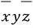
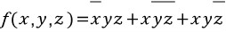
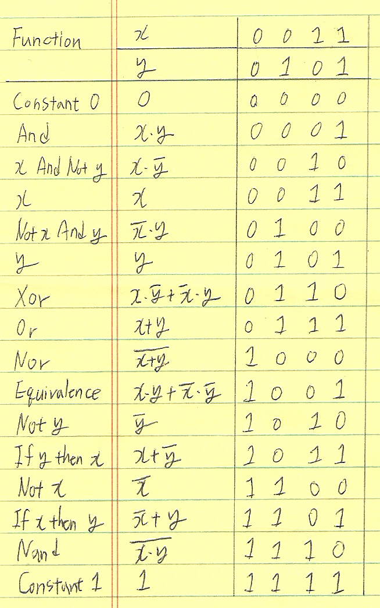
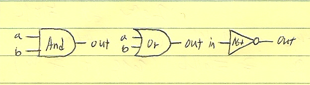
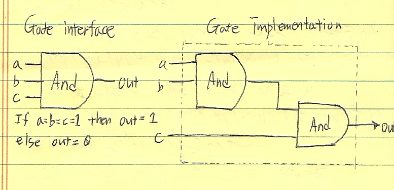

# 불 연산Boolean Logic  

- 모든 디지털 장치들은 정보를 저장하고 처리하기 위해 칩들의 집합을 기반으로 디자인됨.  
- 칩들의 형태와 모양은 모두 다르지만 모두 쉽고 간단한 **논리 게이트**라는 것으로 되어있다.  
- 게이트들은 물리적으로 다른 재료와 제작 기술로 모든 컴퓨터에서 일관성 있게 실행  

## 불 대수Boolean Algebra  

- 불 대수는 보통 true/false, 1/0, yes/no, on/off 등으로 이름 붙여진 불(바이너리) 값으로 다룬다.  
- **불 함수**는 바이너리 입력을 넣고 바이너리 출력을 돌려 받는 연산을 하는 함수  
- 불 함수는 하드웨어 구조의 명시, 구성, 최적화에서 중요한 역할!  

### 진리표True Table  

- 불 함수를 명시하는 가장 쉬운 방법은 함수의 입력 값으로 가능한 모든 값을 열거하는 것.(각 입력들의 함수 결과와 함께)  
  → 진리표라 부른다.  

- 진리표의 예   

 | x | y | z | f(x,y,z) | 
 | --- | --- | --- | :---: |
 | 0 | 0 | 0 | 0 |  
 | 0 | 0 | 1 | 0 |  
 | 0 | 1 | 0 | 1 |  
 | 0 | 1 | 1 | 0 |  
 | 1 | 0 | 0 | 1 |  
 | 1 | 0 | 1 | 0 |  
 | 1 | 1 | 0 | 1 |  
 | 1 | 1 | 1 | 0 |    

- 처음 3개의 열은 함수의 변수와 가능한 바이너리 값을 나열  
- 마지막은 함수의 결과 값  

### 불 연산식Boolean expression  

- 기본적인 불 연산  
 - And   
   - x And y(x∙y or xy): x와 y가 둘 다 1일 때 1  
 - Or  
   - x Or y(x+y): x와 y중 하나만 1일 때 1  
 - Not   
   - Not x: x가 0이면 1  

### 정규 표현canonical representation    

- 모든 불 함수는 정규 표현이라 부르는 적어도 하나의 불 연산식으로 표현이 가능하다.    

 | x | y | z | f(x,y,z) | 
 | --- | --- | --- | :---: |
 | 0 | 0 | 0 | 0 |  
 | 0 | 0 | 1 | 0 |  
 | 0 | 1 | 0 | 1 |  
 | 0 | 1 | 1 | 0 |  
 | 1 | 0 | 0 | 1 |  
 | 1 | 0 | 1 | 0 |  
 | 1 | 1 | 0 | 1 |  
 | 1 | 1 | 1 | 0 |   

 - 위 표에서   
  - 3번째 행: x=0, y=1, z=0. 다음과 같이 나타낼 수 있다.  
     

  - 함수 결과 값이 1인 모든 행을 모아 불 함수의 정규 표현은 다음과 같이 나타낼 수 있다.  
       

 - 결과적으로 모든 불 함수는 그게 얼마나 복잡한지에 상관없이 3가지 불 연산: And, Or, Not을 사용해 표현이 가능  

**2개의 변수를 가진 모든 불 함수**    

   

- Nor(Not-or): x와 y를 Or 연산 후 그 값을 부정  
- Xor(exclusive or): 두 값이 서로 반대되면 1을 반환, 나머지는 0  
- Equivalence: 두 값이 같으면 1 반환  
- If-x-then-y(x→y, x Implies y): x가 0이거나 x,y 모두 1이면 1을 반환  
- Nand  
 - Nand는 흥미로운 이론의 속성을 가진다. 각각의 연산 And, Or 그리고 Not은 Nand로만 구성이 가능하다.  
  - ex) x Or y = (x Nand x)Nand(y Nand u)  
 - 모든 불 함수는 정규 표현을 사용해 And, Or, Not으로 구성할 수 있으므로 모든 불 함수는 Nand 연산 하나로만 구성이 가능  

## 게이트 로직Gate Logic  
- gate: 불 함수를 실행하는 물리적 장치  
- 작은 전환 장치로 만들어진 가장 간단한 게이트는 **트랜지스터**라고 부른다.    
- 현대의 대부분의 게이트들은 칩에 동봉된 실리콘으로 새겨진 트랜지스터로 실행된다.   

- 몇가지 논리 게이트의 표준 심볼   
    
 

### 복합 게이트   

  

- 논리 게이트는 두 가지 관점에서 바라볼 수 있다.  
 : 내부적 관점, 외부적 관점  
- 그림의 오른쪽 부분은 게이트의 내부적 구조 또는 implementations, 왼쪽은 interface, 즉 외부 세계에 드러나져 있는 input, output pins를 의미한다. 전자는 오직 게이트 디자이너와 관계되어 있는 반면에 후자는 내부적 구조에 관심을 가지지 않는 추상적 규격으로 게이트를 사용하기 원하는 다른 디자이너에게 맞는 수준이다.  

